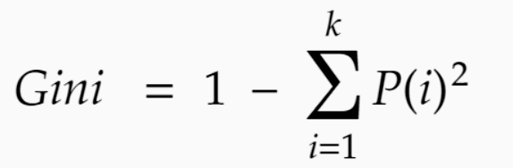
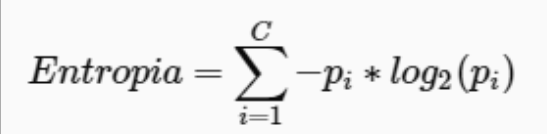

#  Para saber más: Overfitting y Underfitting

Una tarea muy importante para la evaluación de modelos de machine learning es la división de los datos entre entrenamiento y prueba. El conjunto de entrenamiento se utiliza para que el modelo comprenda patrones y relaciones en los datos para que pueda crear una regla para hacer predicciones. El conjunto de prueba, por su parte, se reserva para evaluar el desempeño del modelo en datos que no se utilizaron en el entrenamiento, simulando la capacidad del modelo de generalizar a nuevos datos.

Existen dos conceptos que están muy ligados a esta división de los datos y que son muy relevantes en los proyectos de machine learning: el overfitting y el underfitting.
Overfitting (Sobreajuste):

El overfitting ocurre cuando un modelo se ajusta demasiado a los datos de entrenamiento. Esto indica que el modelo capturó no solo el patrón de los datos, sino también ruidos y variaciones aleatorias que están presentes en los datos utilizados para el entrenamiento. Como resultado de esto, el modelo tiene un resultado muy bueno al ser evaluado con los datos de entrenamiento, sin embargo, su desempeño en los datos de prueba o en datos nuevos cae considerablemente.

Características del overfitting:

    Error muy bajo en las predicciones en datos de entrenamiento;
    Error muy alto en las predicciones en datos de prueba;
    Modelo muy complejo que intenta memorizar los datos de entrenamiento en lugar de aprender el patrón de los datos.

Underfitting (Subajuste):

El underfitting ocurre cuando un modelo es muy simple y no puede capturar el patrón presente en los datos. Esto indica que el modelo no fue capaz de aprender las relaciones existentes en los datos de entrenamiento y termina teniendo un desempeño deficiente tanto en datos de entrenamiento como de prueba.

Características del underfitting:

    Error muy alto en las predicciones en datos de entrenamiento;
    Error muy alto en las predicciones en datos de prueba;
    Modelo muy simple que no puede representar bien los datos.

El objetivo principal de la creación de modelos de machine learning es encontrar un equilibrio entre el overfitting y el underfitting, para que haya un ajuste adecuado. Un modelo bien ajustado es capaz de aprender el patrón de los datos y generalizar a nuevos datos, haciendo predicciones con consistencia sin ser demasiado influenciado por los ruidos presentes en los datos de entrenamiento.

# Utilidad del modelo de base

En proyectos de machine learning, el objetivo principal es construir un modelo que realice la predicción de las categorías de una variable objetivo. El modelo más simple de clasificación se conoce como modelo de base o modelo dummy. Este modelo realiza la clasificación a partir de la categoría de la variable objetivo que tiene mayor frecuencia, prediciendo todos los valores con el mismo resultado.

Seleccione la alternativa que indica el principal objetivo de un modelo de base (modelo dummy) en clasificación:
Seleccione una alternativa

Establecer un rendimiento mínimo que un modelo más avanzado debe superar.

Exactamente, sirve como un modelo de comparación para modelos más complejos, sirviendo de referencia para evaluar el rendimiento de las clasificaciones.

# Para saber más: cómo funciona el árbol de decisión

El árbol de decisión es un algoritmo de machine learning supervisado que tiene una buena interpretabilidad. Esto significa que es posible tener una comprensión fácil de los pasos que se realizaron para llegar al resultado final de la predicción del modelo. Estos pasos pueden ser representados de forma visual, a partir de un diagrama que indica cada una de las decisiones que se tomaron para llegar a la clasificación de un dato.

Para llegar a una regla que clasifique los datos con una buena tasa de acierto, las decisiones del árbol no pueden ser totalmente aleatorias. Debe haber un sentido en cada elección hecha por el árbol de decisión. Ahora entendamos cómo se hacen estas elecciones:

El primer paso es seleccionar una columna de la base de datos que se utilizará para dividir los datos en 2 subconjuntos. El objetivo es que la mayor cantidad posible de datos se separe en relación con la variable objetivo. Entonces, el mejor resultado posible sería si uno de los subconjuntos tuviera solo datos de una categoría de la variable objetivo y el otro subconjunto tuviera solo datos de la otra categoría restante. Para hacer la mejor elección posible, se prueban diferentes columnas y valores, y aquella que proporcione la mejor separación se elige como la primera regla del árbol de decisión.

Para definir qué es una buena separación, se realizan cálculos matemáticos para obtener la proporción de datos de cada categoría de la variable objetivo dentro de los subconjuntos. El resultado de este cálculo se conoce como métrica de impureza. Existen diferentes tipos de métricas, siendo las más utilizadas la entropía y el índice de Gini. A continuación, se presentan las características de cada una.
Índice Gini

Este índice informa el grado de heterogeneidad de los datos. Su objetivo es medir la frecuencia de que un elemento aleatorio de un nodo sea etiquetado de manera incorrecta. En otras palabras, este índice cuantifica y determina la impureza de un nodo mediante el siguiente cálculo:

Donde:

    P(i) representa la frecuencia relativa de las clases en cada uno de los nodos;
    k es el número de clases.

Si el índice Gini es igual a 0, esto indica que el nodo es puro. Sin embargo, si su valor se aproxima más al valor 1, el nodo es impuro.
Entropía

La idea básica de la entropía es medir el desorden de los datos de un nodo mediante la variable clasificadora. Así como el índice de Gini, se utiliza para caracterizar la impureza de los datos y puede ser calculada mediante la siguiente fórmula:

Donde:

    pi representa la proporción de datos en el conjunto de datos, pertenecientes a la clase específica i;
    c es el número de clases.

Después de realizar la primera elección de división, el proceso se repite para cada subconjunto hasta que se alcance una condición de parada o que todos los subconjuntos finales estén totalmente puros, es decir, con solo datos de una de las clases de la variable objetivo. A partir de la regla generada, nuevos datos pueden ser clasificados pasando por cada una de las decisiones del árbol hasta llegar a la elección final.

Si deseas saber más sobre el árbol de decisión, puedes consultar la documentación de la biblioteca Scikit-Learn, que tiene una explicación detallada de cómo funciona y también de la función implementada con el algoritmo:

    Comprendiendo la estructura del árbol de decisión
    DecisionTreeClassifier

# Desafío: hora de la práctica

Después de estudiar los conceptos de esta clase, ¡ha llegado el momento de practicar!

Vamos a practicar lo que se presentó en la clase a partir de algunas actividades, pero utilizando un conjunto de datos diferente al presentado en la clase. El tema de la base de datos es la de churn de clientes. El churn es una métrica que indica a los clientes que cancelan el servicio en un determinado período de tiempo.

Los desafíos siguen una secuencia de tareas, sirviendo como un proyecto secundario, que se realizará a lo largo de las clases del curso. Para realizar los desafíos, descarga la Base de datos - Desafío.

    La separación de los datos entre conjunto de entrenamiento y prueba es esencial para comprender si un modelo está logrando aprender los patrones y generalizar a nuevos datos. En esta tarea, realiza la división de la base de datos entre entrenamiento y prueba de forma estratificada.
    Un modelo base es muy importante para definir un criterio de comparación para modelos más complejos. En esta etapa, crea un modelo base con el DummyClassifier y encuentra la tasa de acierto con el método score.
    El árbol de decisión es un algoritmo que realiza las clasificaciones a partir de decisiones simples tomadas a partir de los datos. Debemos tener cierto cuidado de no utilizar una profundidad muy grande, porque esto puede provocar un sobreajuste del modelo a los datos de entrenamiento. En este desafío, crea un modelo de árbol de decisión con el parámetro max_depth=4, evalúa el desempeño del modelo en los datos de prueba y visualiza las decisiones del árbol usando el método plot_tree.

Para desarrollar este desafío, dedica un tiempo a reflexionar y explorar. Analiza cuidadosamente los datos y las instrucciones de los enunciados de cada pregunta. La colaboración puede proporcionar ideas valiosas. Por eso, no dudes en colaborar con tus compañeros en la comunidad, intercambiar ideas y compartir soluciones en conjunto.

# En esta clase, aprendiste a:

    Separar la base de datos entre entrenamiento y prueba;
    Construir un modelo base con el DummyClassifier;
    Construir un modelo de árbol de decisión con el DecisionTreeClassifier;
    Evaluar un modelo de machine learning usando la tasa de acierto del método score;
    Visualizar las decisiones de un árbol de decisión con el método plot_tree.

