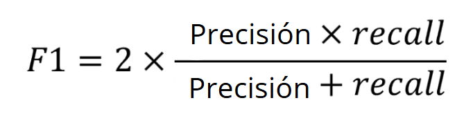

# Para saber más: cuándo usar cada métrica

Evaluar de manera adecuada el desempeño de un modelo de machine learning es esencial para asegurar que el modelo está resolviendo el problema de negocio que necesita ser solucionado. Existen diversas métricas que pueden ser utilizadas para evaluar el desempeño de los modelos de clasificación, cada una de ellas tiene ventajas y limitaciones. Estas métricas se calculan a partir de la comparación entre las clasificaciones realizadas por el modelo y los valores reales de la base de datos. Por lo tanto, pueden ser extraídas a partir de una matriz de confusión. Las principales métricas de clasificación son:
Exactitud

Es la métrica más común y básica en problemas de clasificación. Se utiliza para medir la proporción de datos previstos correctamente por el modelo en relación al total de los datos. Esta métrica es útil cuando las clases de la variable objetivo están balanceadas, es decir, cuando hay una cantidad equilibrada de datos para cada clase y una importancia equivalente de clasificación entre las categorías. Como ejemplo de utilización, tenemos el reconocimiento de dígitos manuscritos. Podemos utilizar imágenes de caracteres de letras y números para entrenar un modelo de clasificación para identificar correctamente la escritura. Como cada letra o número no tiene una importancia mayor que los demás, la exactitud se convierte en una buena métrica para medir la capacidad del modelo en clasificar correctamente los dígitos.

A continuación, podemos analizar el cálculo de la exactitud a partir de la matriz de confusión. Se calcula sumando los aciertos del modelo (VN + VP) y dividiendo por todos los aciertos y errores (VP + VN + FP + FN).
![IMG1 / alt text: Imagen con una fórmula matemática en la parte superior y una representación de la matriz de confusión justo debajo. La fórmula es la exactitud igual a la división de dos términos. El numerador es la suma de verdaderos negativos y verdaderos positivos. El denominador es la suma de verdaderos negativos, falsos positivos, falsos negativos y verdaderos positivos. La matriz de confusión tiene 2 filas y 2 columnas, con valores reales en las filas y valores previstos en las columnas. En la parte superior izquierda, en verde, están los verdaderos negativos. En la parte superior derecha, en rojo, están los falsos positivos. En la esquina inferior derecha están los falsos negativos. En la esquina inferior derecha están los verdaderos positivos.](datos/huswyz5w.png)

Recuperación (recall)

Mide la proporción de datos positivos que fueron correctamente identificados por el modelo, es decir, revela la capacidad del modelo en evitar la clasificación incorrecta de datos positivos como negativos. Se usa cuando el riesgo o costo de clasificar falsos negativos es alto. Por ejemplo, en casos de diagnóstico de enfermedades graves, donde es fundamental detectar correctamente la presencia de la enfermedad.

A continuación, podemos constatar el cálculo del recall a partir de la matriz de confusión. El recall solo toma en cuenta los valores positivos reales, es decir, los valores de la segunda fila de la matriz. Se calcula a partir de la división entre Verdaderos Positivos (VP) y la suma de todos los positivos reales (VP + FN):
![IMG2 / alt text: Imagen con una fórmula matemática en la parte superior y una representación de la matriz de confusión justo debajo. La fórmula es el recall igual a la división de dos términos. El numerador contiene los verdaderos positivos. El denominador es la suma de falsos negativos y verdaderos positivos. La matriz de confusión tiene la segunda fila destacada, que representa los valores reales de la clase 1. La fila destacada tiene los falsos negativos en rojo y verdaderos positivos en verde.](datos/w85z0j0y.png)

Precisión

Mide la proporción de datos clasificados como positivos que son realmente positivos, es decir, revela la capacidad del modelo en evitar la clasificación incorrecta de datos negativos como positivos. Se usa cuando el riesgo o costo de clasificar falsos positivos es alto, por ejemplo, en casos de selección de acciones en el mercado financiero, donde lo importante es seleccionar acciones que tengan gran probabilidad de retorno, reduciendo la cantidad de acciones malas (falsos positivos) incluso si otras buenas acciones no han sido detectadas por el modelo (falso negativo). La precisión también es importante en el ejemplo de detección de enfermedades, donde queremos evitar que pacientes sanos sean erróneamente clasificados como enfermos.

A continuación, podemos analizar el cálculo de la precisión a partir de la matriz de confusión. La precisión solo toma en cuenta los valores positivos previstos por el modelo, es decir, los valores de la segunda columna de la matriz. Se calcula a partir de la división entre Verdaderos Positivos (VP) y la suma de todos los positivos previstos (VP + FP):
![IMG3 / alt text: Imagen con una fórmula matemática en la parte superior y una representación de la matriz de confusión justo debajo. La fórmula es la precisión igual a la división de dos términos. El numerador contiene los verdaderos positivos. El denominador es la suma de falsos positivos y verdaderos positivos. La matriz de confusión tiene la segunda columna destacada, que representa los valores previstos de la clase 1. La columna destacada tiene los falsos positivos en rojo y verdaderos positivos en verde.](datos/3kwumnm1.png)

F1-Score

Proporciona un equilibrio entre el recall y la precisión, siendo útil cuando las clases de la variable objetivo están desbalanceadas, es decir, cuando hay una cantidad de datos muy diferente para cada clase. Además, es aplicable cuando el riesgo o costo de falsos positivos y de falsos negativos es alto simultáneamente. En casos de detección de tumores en pacientes, es necesario tener un equilibrio entre evitar errores en la detección de tumores cuando la persona realmente los tiene y evitar errores al informar que una persona tiene un tumor cuando en realidad no lo tiene.

El cálculo del F1-Score se realiza a partir de la media armónica entre la precisión y el recall. Por lo tanto, equivale a 2 veces la precisión por el recall, dividido por la suma entre la precisión y el recall:

La elección de la métrica de clasificación adecuada depende del problema que se está resolviendo y de cada escenario. En los casos en que las clases están balanceadas y tienen importancia similar, la exactitud puede ser una buena métrica inicial. Sin embargo, cuando las clases están desequilibradas o los errores tienen costos diferentes, métricas como precisión, recall y F1-score son más indicadas.

# Análisis gráfico

Para un análisis más detallado del resultado de un modelo de clasificación, es posible explorar métricas numéricas, matrices de confusión e incluso gráficos. Entre los gráficos de análisis de rendimiento de modelos, dos se destacan: la curva ROC y la curva de precisión x recall.

A partir de esto, selecciona la alternativa que indica la diferencia entre la curva ROC y precisión x recall:
Seleccione una alternativa

La curva de precisión x recall es mejor para evaluar datos que tienen clases más desbalanceadas.

Como la curva de precisión x recall no evalúa la tasa de verdaderos negativos, que generalmente contendrá la mayor cantidad de datos, el análisis se concentra más en la clase con menor cantidad de datos, y esto hace que el análisis sea mejor en datos desbalanceados.

# Contenido del informe de métricas

Cuando se trata de evaluar un modelo de clasificación, no hay una sola opción para entender el comportamiento del modelo y determinar si está funcionando bien o no para el problema propuesto. Existen muchas métricas distintas, cada una con sus características, que pueden ser utilizadas en conjunto para la decisión final del análisis.

Una manera muy simple de resumir el resultado de un modelo es a partir del classification_report o informe de clasificación. En él, es posible encontrar las principales métricas en una sola tabla. Sabiendo esto, selecciona la alternativa que corresponde al contenido del informe de clasificación:
Seleccione una alternativa

Proporciona métricas como precisión, recall y f1-score, además de un promedio general y ponderado de las métricas entre las clases.

¡Exactamente! El informe presenta la precisión, recall y f1-score de cada clase, además de devolver un promedio de estas métricas de forma general o ponderada en relación a la cantidad de datos de cada clase.

#  Desafío: hora de la práctica

Vamos a practicar el contenido que se presentó en la clase a partir de algunas actividades, pero usando un conjunto de datos diferente con datos de pacientes a ser diagnosticados con diabetes o no. Los desafíos siguen una secuencia de tareas, sirviendo como un proyecto secundario. Para realizar los desafíos, descarga la base de datos desde este enlace.

Estos desafíos dependen del modelo generado en los desafíos de la clase 1.

1 - Para una evaluación completa de un modelo de clasificación, podemos explorar métricas que evalúan la tasa de acierto general y también para cada clase de la variable objetivo de forma individual. Extrae las métricas de precisión, recall, precisión y F1-Score de los modelos de clasificación generados en el desafío de la clase 1. La biblioteca Scikit-Learn tiene funciones para calcular cada una de las métricas, solo necesitas importar y utilizar como parámetros los valores reales y previstos por el modelo.

2 - Además de métricas numéricas, se pueden explorar gráficos para evaluar el rendimiento de un modelo y comprender si puede diferenciar bien una clase de otra. Obtén la curva ROC y la métrica AUC de los modelos de clasificación generados en el desafío de la clase 1, comparando las curvas en el mismo gráfico. La curva ROC se puede generar usando el método RocCurveDisplay.from_predictions.

3 - Además de la curva ROC, la curva de precisión x recall se puede usar para evaluar el rendimiento de modelos, siendo más interesante para datos desbalanceados. Obtén la curva de precisión x recall y la métrica AP de los modelos de clasificación generados en el desafío de la clase 1, comparando las curvas en el mismo gráfico. La curva de precisión x recall se puede generar usando el método PrecisionRecallDisplay.from_predictions.

4 - Un resumen de las principales métricas de clasificación puede ser muy útil para resumir la información y generar insights de forma rápida. Genera los informes de métricas de los modelos de clasificación construidos en el desafío de la clase 1. El informe de métricas se puede generar a partir de la función classification_report de la biblioteca Scikit-Learn.

Como consejo, revisa la documentación de Scikit-learn desde este enlace y verifica una forma de presentar los resultados de las curvas en el mismo gráfico usando matplotlib.

# En esta clase, aprendiste a:

    Seleccionar la métrica de clasificación más coherente de acuerdo con el problema;
    Extraer precisión, exactitud y recall a partir de la matriz de confusión;
    Generar gráficos de la curva ROC y precisión x recall usando la biblioteca Sklearn;
    Construir un informe con las principales métricas de rendimiento de modelos de clasificación.

