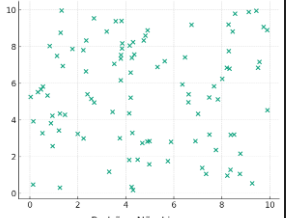

# Manos a la obra: mapa de calor de correlación

¿Vamos a practicar el concepto de correlación?

Durante la clase, exploramos la correlación entre cada característica de la casa y su precio; sin embargo, el coeficiente de correlación también se puede aplicar a cualquier par de variables.

En esta actividad, analiza la correlación de todas las variables a través de una forma visual, ejecutando el código a continuación en una celda de tu notebook.
``` python
# Actividad
import pandas as pd
import numpy as np
import matplotlib.pyplot as plt
import seaborn as sns

# Leyendo datos
datos = pd.read_csv("/content/Precios_de_casas.csv")
datos = datos.drop(columns = "Id")

# Correlación
corr = datos.corr()

# ¿Qué factores están más correlacionados?

# Generar una máscara para el triángulo superior
mascara = np.zeros_like(corr, dtype=bool)
mascara[np.triu_indices_from(mascara)] = True

# Configurar la figura de matplotlib
f, ax = plt.subplots(figsize=(11, 9))

# Generar el mapa de calor (heatmap)
cmap = sns.diverging_palette(220, 10, as_cmap=True)

sns.heatmap(corr, mask=mascara, cmap=cmap, vmax=1, vmin=-1, center=0,
            square=True, linewidths=.5, annot=True, cbar_kws={"shrink": .5})

# Mostrar el mapa de calor (heatmap)
plt.show()
```
Consejo: Presta atención a los puntos a continuación para un análisis completo:

    Intensidad: se refiere a la fuerza de la relación entre las variables medidas. Puede variar de -1 a +1, donde -1 indica una correlación perfectamente negativa, +1 indica una correlación perfectamente positiva y 0 indica ausencia de correlación lineal.
    Dirección: se refiere a la naturaleza de la relación entre las variables medidas. Una correlación positiva indica que las variables aumentan o disminuyen juntas, mientras que una correlación negativa indica que una variable aumenta mientras la otra disminuye, o viceversa.

Ejemplo:

El coeficiente de correlación lineal entre el área del primer piso y el precio de venta es de 0.62, indicando una correlación positiva moderadamente fuerte (intensidad). En general, a medida que el área del primer piso de una casa aumenta, el precio de venta también tiende a aumentar (dirección).

# Formatos de los gráficos de dispersión

Sara está analizando datos y decidió construir varios gráficos de dispersión para comprender la relación entre las variables de su conjunto de datos. Ahora, vamos a ayudar a Sara a entender lo que representa cada gráfico.

Con base en los gráficos de dispersión realizados por Sara, ¿cuál de los siguientes análisis es correcto? Elige una alternativa.


Los puntos están esparcidos aleatoriamente, sin mostrar ninguna tendencia clara entre las variables.

7.ActividadB / Gráfico de dispersión con puntos esparcidos aleatoriamente


El gráfico de dispersión es una excelente herramienta para identificar tendencias entre variables, sin embargo, también es posible identificar la ausencia de correlación entre las variables, es decir, cuando no tienen una relación lineal clara entre sí, presentando, de esta forma, puntos dispuestos de manera aleatoria.


# En esta clase, aprendiste a:

    Obtener el coeficiente de correlación de los datos;
    Analizar la intensidad y la dirección de la correlación entre dos variables;
    Identificar la linealidad en el gráfico de dispersión;
    Diferenciar la variable explicativa de la variable respuesta;
    Visualizar la mejor línea utilizando Plotly.

