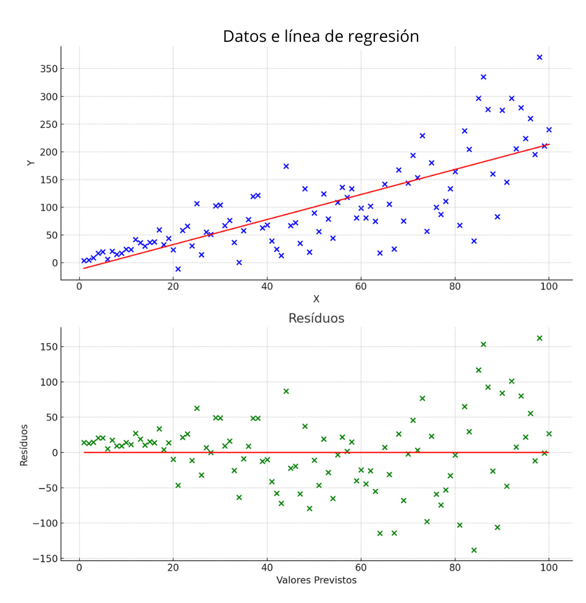

# Estrategia para la optimización de modelos de regresión

Ana está analizando la multicolinealidad en su modelo de regresión lineal, que fue construido para predecir los precios de inmuebles en función de varias características. Ella notó que dos variables, "existe_segundo_andar" y "area_segundo_andar", tienen VIFs de 7.455059 y 7.589396, respectivamente. ¿Cuál de las siguientes afirmaciones describe mejor la situación y los pasos que Ana puede tomar para abordar el problema de multicolinealidad?
Selecciona 2 alternativas 

Los VIFs muestran una fuerte evidencia de multicolinealidad. Ana puede considerar combinar ambas en una sola variable.

Combinar ambas características en una sola variable es una posibilidad viable para resolver el problema de la multicolinealidad, pero también tiene desventajas. La principal es la pérdida de interpretabilidad. Al combinar variables, puedes perder la capacidad de entender cómo cada variable original contribuye individualmente a explicar la variable dependiente. Además, no hay garantía de que la combinación de variables resolverá completamente el problema de la multicolinealidad, especialmente si hay múltiples variables altamente correlacionadas que contribuyen a la complejidad del modelo... 

Los VIFs muestran una fuerte evidencia de multicolinealidad. Ana puede considerar eliminar una de las variables para reducir la multicolinealidad.

Los valores de VIF superiores a 5 generalmente indican una fuerte multicolinealidad, sugiriendo que las variables están correlacionadas y pueden influir negativamente en la interpretación de los coeficientes del modelo. Al eliminar o combinar variables correlacionadas, Ana puede mejorar la precisión y la interpretabilidad de su modelo de regresión lineal. 

# Para saber más: entendiendo la heterocedasticidad

Cuando nos sumergimos en el universo del análisis de datos, un concepto fundamental que encontramos con frecuencia es la regresión lineal. Esta técnica nos permite entender relaciones y prever tendencias basándonos en datos existentes. Sin embargo, al aplicar la regresión lineal, es crucial estar atentos a la heterocedasticidad, una característica que puede afectar significativamente la interpretación de los resultados.
¿Qué es la Heterocedasticidad?

La heterocedasticidad es un término utilizado en estadística para describir una situación en la que la varianza de los errores (o residuos) de un modelo de regresión no es constante a lo largo del rango de valores previstos. En términos simples, si la dispersión de los residuos varía en diferentes niveles del predictor, estamos ante la heterocedasticidad. Esto es un problema porque la mayoría de los métodos de regresión lineal asumen homocedasticidad, es decir, que los residuos tienen varianza constante en todos los niveles de los predictores.

6.ParaSaberMas/Un gráfico de dispersión en dos paneles, con el superior mostrando una línea de regresión lineal sobre puntos azules que indican datos sintéticos, y el inferior exhibiendo residuos en verde, que aumentan en varianza con el aumento de los valores previstos en el eje-x.
¿Por qué es un Problema la Heterocedasticidad?

La presencia de heterocedasticidad puede llevar a estimaciones de coeficientes ineficientes y a pruebas de hipótesis inválidas, comprometiendo la confiabilidad de las inferencias estadísticas. Aunque no afecta la imparcialidad o la consistencia de los estimadores de mínimos cuadrados ordinarios, impacta en la eficiencia de estos estimadores, haciéndolos menos confiables.
Identificando la Heterocedasticidad

Uno de los métodos más comunes para detectar la heterocedasticidad es a través del análisis visual de los residuos. Después de ajustar un modelo de regresión lineal, podemos graficar los residuos en función de los valores previstos. Si los residuos se dispersan de manera uniforme, sin formar patrones o embudos, el modelo probablemente presenta homocedasticidad. Por otro lado, si la dispersión de los residuos aumenta o disminuye con los valores previstos, esto indica heterocedasticidad.
¿Cómo Evaluar la Heterocedasticidad?

Además de un análisis visual de los residuos, existen varias pruebas estadísticas para evaluar formalmente la presencia de heterocedasticidad, como la prueba de White y la prueba de Breusch-Pagan. Estas pruebas ayudan a cuantificar si la varianza de los residuos está relacionada con los valores previstos, proporcionando una base más sólida para decidir si la heterocedasticidad es una preocupación significativa en el modelo.
Tratando la Heterocedasticidad

Si identificamos heterocedasticidad, se pueden adoptar varias enfoques para abordar el problema, como la transformación de variables (por ejemplo, logarítmica o raíz cuadrada) o el uso de técnicas de regresión robustas, que son menos sensibles a la varianza de los residuos.
Conclusión

Al comprender e identificar la heterocedasticidad, podemos tomar medidas apropiadas para garantizar que nuestros análisis de regresión lineal sean confiables y válidos. Este cuidado nos permite hacer inferencias más precisas y fundamentadas, esenciales para la toma de decisiones basadas en datos.

# Evaluando la dispersión de los residuos

João está analizando la eficacia de un modelo de regresión utilizado para fijar precios de casas. Examinó un gráfico de dispersión de los residuos (diferencia entre los valores reales y estimados) en relación con los precios previstos de las casas. João se dio cuenta de que, aunque la mayoría de los residuos están alrededor de 0, la dispersión de los residuos aumenta a medida que el precio previsto de las casas aumenta. Ante este escenario, ¿qué indica esta observación sobre el modelo? Elige la alternativa correcta.

A medida que el precio de las casas aumenta, el modelo se vuelve menos confiable, indicado por la mayor dispersión de los residuos.

Una dispersión creciente de los residuos en relación con el aumento del precio previsto indica que el modelo tiene dificultades para predecir con precisión casas de mayor valor. Esto sugiere que el modelo puede no estar capturando todas las variables o patrones relevantes para casas más caras, resultando en predicciones menos precisas para esos inmuebles.

# Para ir más profundo

    Documentación de Statsmodels - Regresión (gratuito, inglés, texto/código) https://www.statsmodels.org/stable/regression.html

        Esta página proporciona una visión detallada de las funcionalidades de regresión disponibles en la biblioteca Statsmodels. Ideal para quienes buscan profundizar sus conocimientos en modelos estadísticos y análisis de datos en Python, la documentación presenta explicaciones técnicas, ejemplos de código e información sobre diferentes tipos de regresión, como la regresión lineal y logística.

    Análisis de Regresión - ESALQ (gratuito, portugués, texto) https://www.esalq.usp.br/biblioteca/sites/default/files/Analise_Regress%C3%A3o.pdf

        Este documento de ESALQ aborda conceptos y aplicaciones del análisis de regresión, ofreciendo un material rico para estudiantes y profesionales del área de estadística. Con un enfoque didáctico, el texto discute los fundamentos de la regresión, incluyendo modelos lineales y no lineales, además de presentar ejemplos prácticos que ilustran la aplicación de estas técnicas en diferentes contextos.

    Guía Manga Análisis de Regresión - Google Libros (de pago, portugués, texto) https://www.google.com.br/books/edition/Guia_Mang%C3%A1_An%C3%A1lise_de_Regress%C3%A3o/QWCHDwAAQBAJ?hl=pt-BR&gbpv=0

        El "Guía Manga Análisis de Regresión" es un enfoque innovador y lúdico para entender el análisis de regresión. Este libro combina ilustraciones al estilo manga con explicaciones técnicas, haciendo que el aprendizaje sea más accesible y divertido. Es una excelente opción para quienes buscan una introducción amigable a los conceptos de regresión, ideal para estudiantes y entusiastas que desean explorar esta área de las matemáticas y la estadística.

# En esta clase, aprendiste a:

    Comprender el concepto de multicolinealidad y cómo puede afectar la interpretación de los coeficientes en un modelo de regresión lineal;
    Utilizar el Factor de Inflación de la Varianza (VIF) para cuantificar e identificar problemas de multicolinealidad entre variables explicativas;
    Crear e interpretar gráficos de dispersión comparando los valores predichos por el modelo con los valores reales, identificando limitaciones del modelo;
    Analizar los residuos del modelo para verificar la presencia de homocedasticidad, es decir, si la varianza de los residuos es constante;
    Analizar las limitaciones del modelo, especialmente en la fijación de precios de propiedades más caras, y discutir la importancia de explorar nuevas variables explicativas.

