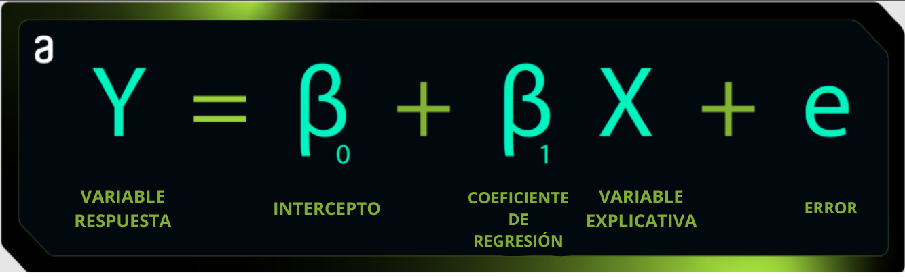
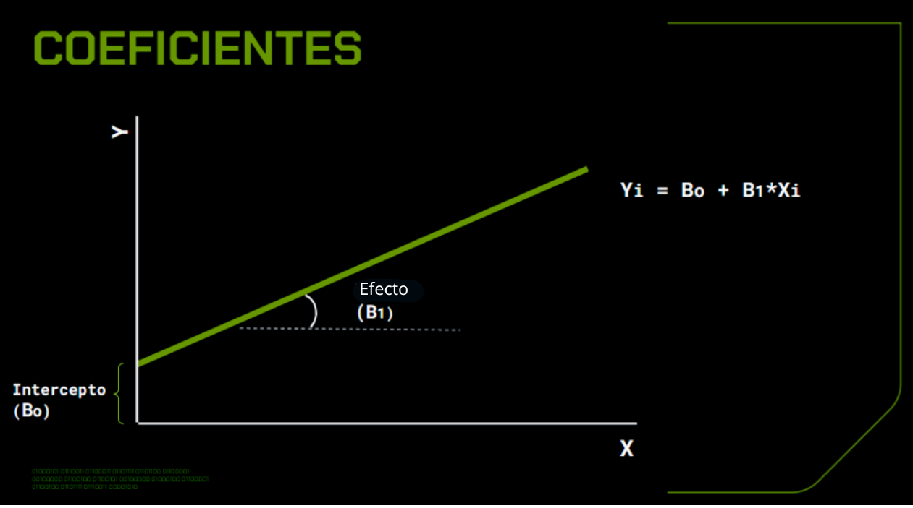
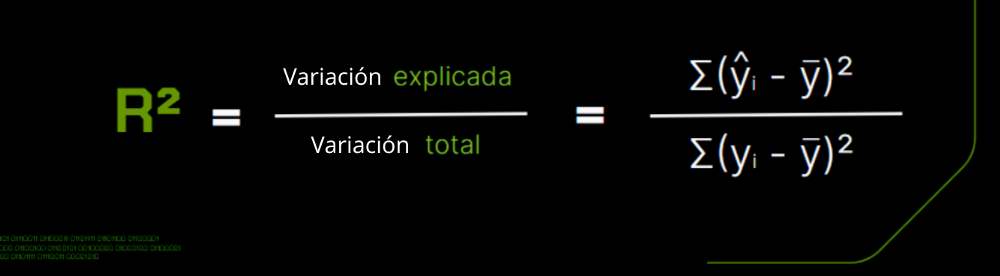

# Separando el conjunto de datos

Diana está comenzando sus estudios en ciencia de datos y se dio cuenta de que separar conjuntos de datos en entrenamiento y prueba es una práctica recurrente en machine learning.

Con base en esto, surge la pregunta: ¿Cuál es la principal razón para dividir un conjunto de datos en conjuntos de entrenamiento y prueba al construir modelos de machine learning? Elige una alternativa.

Para evaluar el desempeño del modelo en datos no vistos.

Dividir el conjunto de datos en conjuntos de entrenamiento y prueba es una práctica esencial en machine learning para evaluar la capacidad de generalización del modelo. El conjunto de entrenamiento se usa para entrenar el modelo, mientras que el conjunto de prueba se mantiene separado y se usa para evaluar el desempeño del modelo en datos no vistos, simulando cómo se comportaría el modelo al ser aplicado en situaciones reales.

# Para saber más: estimación de la regresión lineal simple

La regresión lineal fue la metodología que ajustó la mejor línea que representa linealmente la interacción entre X e Y; en nuestro caso, el tamaño del área del primer piso y el precio de venta de la casa.

Vale la pena repasar cada componente de la regresión lineal:
Función


    Variable Respuesta (Y): También llamada variable dependiente, es aquella que estamos tratando de predecir.
    Intercepto (β₀): El punto donde la línea de regresión intercepta el eje vertical (Y), es decir, el valor de Y cuando X es igual a 0.
    Variable Explicativa (X): También llamada variable independiente, es el factor que usamos para predecir y explicar la variable respuesta.
    Coeficientes de Regresión (β₁): Impacto de cada variable explicativa X en la variable respuesta, es el efecto de X en Y.
    Error Residual (e): Diferencia entre los valores reales y previstos de la variable respuesta.

Coeficientes

La relación lineal entre las variables X e Y se representa gráficamente por una línea. Este proceso de encontrar la línea ideal implica minimizar la distancia entre los puntos reales y la propia línea.

El ajuste de la línea de regresión lineal se simplifica mediante el método de los mínimos cuadrados. Este método tiene como objetivo encontrar la línea que mejor se ajusta a los datos observados, minimizando la suma de los cuadrados de las diferencias entre los valores reales y los valores previstos por la línea y calculando los coeficientes del modelo.


#  Para saber más: explicabilidad

El coeficiente de determinación, frecuentemente llamado R², es una medida estadística que indica cuánto de la variabilidad de la variable dependiente (respuesta) es explicada por el modelo de regresión lineal.
Interpretando el R²

Varía de 0 a 1, un valor cercano a 1 indica que el modelo se ajusta bien a los datos, explicando la mayor parte de la variación en la variable dependiente/respuesta. Por otro lado, un valor cercano a 0 indica que el modelo no puede explicar mucha variación en la variable dependiente/respuesta.
Usando en la prueba

Además, el R² puede ser utilizado para comparar el rendimiento del modelo en diferentes conjuntos de datos, como entrenamiento y prueba. Esto ayuda a identificar problemas de sobreajuste (overfitting) o subajuste (underfitting). Idealmente, deseamos que el R² sea consistente entre los conjuntos de entrenamiento y prueba, indicando una buena capacidad de generalización del modelo para nuevos datos.
Fórmula

Una de las fórmulas del R² puede ser representada por la razón entre la variación explicada y la variación total. Por eso decimos que cuanto más cerca de 1, mejor es la adecuación del modelo, ya que la variación explicada será más cercana a la variación total en esta razón.



#  Hazlo como yo lo hice: analizando la variable respuesta

Durante esta clase, nos enfocamos en analizar el comportamiento de la variable respuesta, es decir, comprender el precio de venta de la casa.

Para esto, hicimos un histograma como recurso visual para facilitar este análisis.
```python
sns.displot(dados['precio_de_venta'], kde=True, color='green')
plt.title('Distribución del precio de venta')
plt.show()
```
En esta actividad, aplica la función displot de la biblioteca Seaborn (sns) y explora los aspectos de la visualización de datos. Para ello, utiliza tus conocimientos adquiridos hasta el momento y desarrolla tus habilidades aún más.

Esta función se usa para crear un gráfico de distribución. El parámetro kde=True indica que queremos trazar la densidad de kernel estimada sobre el histograma. A través de este ejercicio práctico, tendrás la posibilidad de visualizar la forma de la distribución con más suavidad.

# En esta clase, aprendiste a:

    Dividir la base de datos para entrenar y probar el modelo;
    Interpretar los coeficientes de regresión lineal simple;
    Calcular e interpretar el coeficiente de determinación R²;
    Analizar cuánto se desvía cada punto de datos de la línea de regresión ajustada a través de los residuos;
    Comprender qué tan bien se ajustan los valores observados al modelo de regresión con R²;
    Calcular el R² en el conjunto de prueba.

