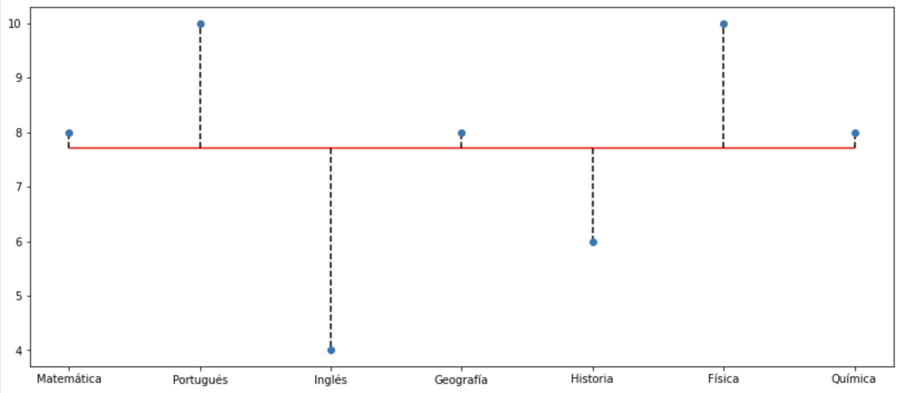

# Para saber más: entendiendo mejor la desviación media absoluta

Hemos visto cómo calcular la desviación estándar, una medida clave de dispersión que nos indica cuánto se alejan, en promedio, los datos de la media. Pero, ¿cómo podemos visualizar estas desviaciones de manera gráfica para entender mejor la distribución de nuestros datos?

El gráfico muestra las notas de María en 7 materias diferentes: Matemática, Portugués, Inglés, Geografía, Historia, Física y Química. Cada materia está representada en el eje horizontal, y las notas correspondientes se muestran en el eje vertical.

Elementos Clave:

Puntos Azules: Representan las notas de María en cada materia. Por ejemplo, en Matemática obtuvo una nota de 8.

Línea Roja Horizontal: Esta línea indica la media (promedio) de todas las notas de María. En este caso, la media parece ser 8.

Líneas Punteadas Verticales: Para cada materia, hay una línea punteada que conecta la nota de María con la línea roja de la media.

La longitud de estas líneas representa visualmente la desviación de cada nota respecto a la media.

Si la línea punteada va hacia arriba, significa que María obtuvo una nota superior a la media en esa materia.

Si la línea punteada va hacia abajo, la nota está por debajo de la media.

Interpretación:

Rendimiento General: En general, María parece tener un rendimiento consistente, ya que la mayoría de sus notas están cerca de la media (línea roja).

Materias Destacadas: En Historia y Física, las líneas punteadas son más largas y apuntan hacia arriba, lo que indica que María obtuvo notas significativamente superiores a su media en esas materias.

Materias a Mejorar: En Portugués e Inglés, las líneas punteadas son más largas y apuntan hacia abajo, sugiriendo que María obtuvo notas inferiores a su media en esas materias.

Conclusión:

Este gráfico nos permite visualizar rápidamente el rendimiento de María en cada materia en relación con su promedio general. Nos da una idea de en qué materias se destaca y en cuáles podría necesitar mejorar.

# Calculando e Interpretando la Desviación Estándar

Un grupo de 6 amigos registró el número de horas que durmieron la noche anterior. Los datos son los siguientes:

    7 horas
    6 horas
    8 horas
    7.5 horas
    6.5 horas
    8.5 horas

Calcula la desviación estándar de estas horas de sueño.

0.94 horas.

Alternativa correcta!

    Primero, calculamos la media: (7 + 6 + 8 + 7.5 + 6.5 + 8.5) / 6 = 7.25
    Luego, calculamos las desviaciones de cada valor respecto a la media: -0.25, -1.25, 0.75, 0.25, -0.75, 1.25
    Elevamos al cuadrado cada desviación: 0.0625, 1.5625, 0.5625, 0.0625, 0.5625, 1.5625
    Sumamos los cuadrados de las desviaciones: 0.0625 + 1.5625 + 0.5625 + 0.0625 + 0.5625 + 1.5625 = 4.375
    Dividimos la suma entre (n-1), donde n es el tamaño de la muestra (6): 4.375 / 5 = 0.875
    Finalmente, calculamos la raíz cuadrada de la varianza para obtener la desviación estándar: √0.875 ≈ 0.935
    Redondeando a dos decimales, la desviación estándar es de aproximadamente 0.94 horas.

# Lo que aprendimos en esta aula:

    Como obtener tres medidas de dispersión importantes. La desviación media absoluta, la varianza y la desviación estándar.
    Aunque las medidas de posición brindan un resumen muy importante de los datos, pueden no ser suficientes para caracterizar diferentes conjuntos, especialmente cuando las observaciones de una distribución dada presentan datos muy dispersos.
        Por lo tanto, para complementar nuestros análisis y poder caracterizar mejor el conjunto de datos, utilizamos las medidas de dispersión.

