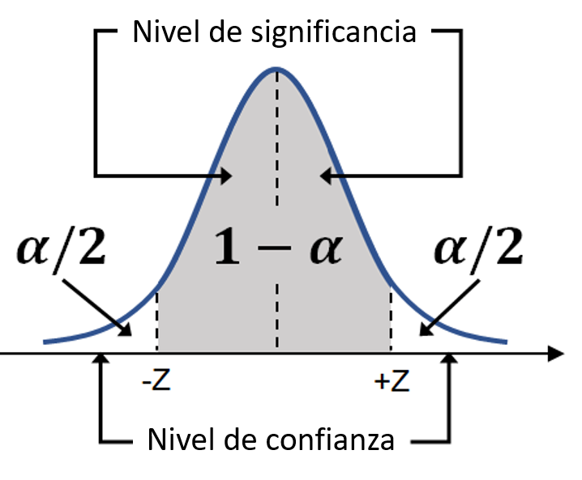

# Conceptos de estimación

En nuestra última clase, llegamos a conocer el Teorema central del límite y, a partir de un ejemplo, entendimos cada punto de su enunciado.

Evalúe las siguientes alternativas y marque la que tenga el enunciado correcto del teorema que aprendimos.

El Teorema central del límite establece que, con el aumento del tamaño de la muestra, la distribución de las medias muestrales se aproxima a una distribución normal, con un media igual a la media de la población y una desviación estándar igual a la desviación estándar de la variable original dividida por la raíz cuadrada del tamaño de la muestra. Este hecho está asegurado para n mayor o igual a 30

¡Alternativa correcta! Exactamente como se presenta en nuestro cuaderno de estudio. Cambie los tamaños de muestra y las variables seleccionadas para verificar la validez del teorema en otros escenarios.

# Sobre los niveles de confianza y significancia

Con respecto a los niveles de confianza e importancia, evalúe las siguientes afirmaciones:

1) El nivel de confianza (1 - α) representa la probabilidad de que la estimación sea correcta. De forma complementaria, el nivel de significancia (α) expresa la probabilidad de error de la estimación

2) El nivel de confianza representa el grado de confiabilidad del resultado estimado dentro de un cierto rango

3) El nivel de confianza de una estimación se puede obtener del área bajo la curva normal, como se ilustra en la siguiente figura:

¿Qué afirmaciones son correctas?

Sólo las afirmaciones 1 y 2 son correctas

¡Alternativa correcta! El nivel de confianza de una estimación se puede obtener del área bajo la curva normal, como se ilustra en la siguiente figura:

# Lo que aprendimos en esta aula:

    Los conceptos de parámetros y estimaciones
    El Teorema Central de Límite
    Niveles de confianza y significancia
    Obtener el margen de error de un experimento
    Obtener intervalos de confianza para una estimación puntual (estimación por intervalo) 

