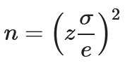
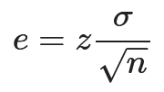

# Tamaño de la muestra

Marque la alternativa que presenta la forma correcta de obtener el tamaño de una muestra cuando los datos son cuantitativos, se conoce la desviación estándar de la población y la población es infinita.

img

¡Alternativa correcta! Recordando que la desviación estándar y el error deben estar en la misma unidad de medida.

# Revisando el contenido

Evalúe las siguientes afirmaciones:

1) Un evento binomial se caracteriza por la posibilidad de que sólo ocurran dos categorías. Estas categorías juntas representan el espacio muestral completo, y también son mutuamente excluyentes, es decir, la ocurrencia de una implica la no ocurrencia de la otra.

2) La distribución de Poisson se usa para describir el número de ocurrencias en un tiempo o espacio específico. Los eventos se caracterizan por la posibilidad de contar los éxitos, pero la no posibilidad de contar los fracasos.

3) La distribución normal es una distribución continua y asimétrica en relación a su media.

¿Cuáles son las correctas?

Sólo las afirmaciones 1 y 2 son correctas

¡Alternativa correcta! La distribución normal es simétrica en relación a su media.

las afirmaciones correctas son:

    1) Un evento binomial se caracteriza por la posibilidad de que sólo ocurran dos categorías. Estas categorías juntas representan el espacio muestral completo, y también son mutuamente excluyentes, es decir, la ocurrencia de una implica la no ocurrencia de la otra.

    2) La distribución de Poisson se usa para describir el número de ocurrencias en un tiempo o espacio específico. Los eventos se caracterizan por la posibilidad de contar los éxitos, pero la no posibilidad de contar los fracasos.

# Revisando el contenido un poco más

Evalúe las siguientes afirmaciones:

1) Los atributos numéricos de una población, como su media, varianza y desviación estándar, se conocen como parámetros. El enfoque principal de la inferencia estadística es precisamente generar estimaciones y probar hipótesis sobre parámetros de población utilizando información de la muestra.

2) El teorema central del límite establece que, con el aumento del tamaño de la muestra, la distribución de las medias muestrales se aproxima a una distribución normal, con un promedio igual a la media de la población y una desviación estándar igual a la desviación estándar de la variable original dividida por la raíz cuadrada del tamaño de la muestra. Este hecho está asegurado para n menor o igual a 30.

3) El error inferencial se define por la desviación estándar de las medias muestrales y por el nivel de confianza determinado para el proceso:

img

¿Qué afirmaciones son correctas?

Sólo las afirmaciones 1 y 3 son correctas

¡Correcta alternativa! El error inferencial también se conoce como margen de error.

# Lo que aprendimos en esta aula:

    Comprender los intervalos de confianza, con la realización de simulaciones de procesos de muestreo con prueba gráfica
    La aplicación de las técnicas desarrolladas durante el curso para la solución de problemas reales
    Las dimensiones de un proceso de investigación de campo, con control del costo y margen de error

