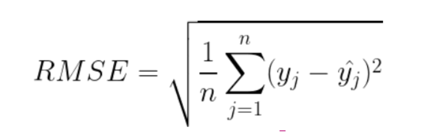

# Para saber más: métricas utilizadas en regresión

Durante el video, se presentaron algunas de las métricas más comunes para evaluar modelos de regresión, como RMSE, MAE y R2. Junto con estas métricas, existen diversas otras que pueden ser bastante útiles durante la evaluación de un modelo de regresión. A continuación, podrás encontrar algunas de las métricas más utilizadas y sus traducciones en español:

    Mean squared error - MSE (Error Cuadrático Medio);
    Mean absolute error - MAE (Error Absoluto Medio);
    Root Mean Squared Error - RMSE (Raíz Cuadrada del Error Cuadrático Medio);
    Mean Squared Logarithmic Error - MSLE (Error Logarítmico Cuadrático Medio); y
    Mean Absolute Percentage Error - MAPE (Porcentaje del Error Absoluto Medio).

Mean squared error - MSE

El Mean Squared Error (MSE), o Error Cuadrático Medio, es una métrica ampliamente utilizada para evaluar el rendimiento de un modelo de aprendizaje automático. Esta métrica calcula la media de los errores cuadrados, donde cada error es la diferencia entre el valor previsto por el modelo y el valor real. La elevación al cuadrado da mayor peso a los errores mayores, lo que puede ser útil cuando esos errores son particularmente indeseables. El MSE se define matemáticamente como:

En esta fórmula, "n" representa el número de observaciones o muestras, "y_i" es el valor real de la i-ésima observación y "ŷ_i" es el valor predicho para la i-ésima observación. El MSE se calcula tomando la diferencia entre los valores reales y los valores predichos, elevando al cuadrado, sumando todas estas diferencias al cuadrado y, a continuación, dividiendo por el número de observaciones "n".

Para evaluar la calidad de un modelo usando el MSE, cuanto más cerca de 0 esté el valor del MSE, mejor estará el modelo en predecir los valores deseados. Esto se debe a que un MSE de 0 indica que no hay diferencia entre los valores previstos y los valores reales, es decir, el modelo está haciendo predicciones perfectas.

Aunque el MSE es una métrica útil, vale la pena mencionar que tiene la desventaja de dar más peso a los outliers debido al cuadrado de cada término. Esto puede ser indeseable en muchos casos, llevando a los investigadores a usar alternativas, como el error absoluto medio (MAE).

La documentación de scikit-learn tiene información que ofrece más detalles sobre esta métrica en “mean_squared_error”. https://scikit-learn.org/stable/modules/generated/sklearn.metrics.mean_squared_error.html

Mean absolute error - MAE

El Error Absoluto Medio (MAE) es una medida de error común utilizada en modelos de regresión. Se calcula tomando la media de los valores absolutos de los errores. En otras palabras, para cada punto de datos, primero calculamos el error (la diferencia entre el valor predicho y el valor real), tomamos el valor absoluto de ese error (para asegurar que todos los errores sean positivos), y luego calculamos la media de todos estos errores absolutos. El MAE se define como:

En esta ecuación, "n" representa el número de observaciones o muestras, "y_i" es el valor real de la i-ésima observación y "ŷ_i" es el valor predicho para la i-ésima observación. El MAE se calcula tomando la diferencia absoluta entre los valores reales y los valores predichos para todas las observaciones, sumando estas diferencias absolutas y, a continuación, dividiendo por el número de observaciones "n".

El MAE es similar a la Métrica del Error Cuadrático Medio (MSE), pero en lugar de elevar los errores al cuadrado, simplemente toma el valor absoluto de los errores. Esto hace que el MAE sea menos sensible a outliers que el MSE, ya que los errores grandes no se amplifican por el cuadrado.

Al evaluar modelos de regresión con el MAE, un valor menor indica un modelo más preciso. En otras palabras, cuanto menor sea el MAE, mejor será el modelo en predecir el valor correcto para nuevos datos. El MAE tiene un límite inferior de 0, que indica un modelo perfecto (es decir, todas las predicciones son exactas).

Cabe destacar que, aunque el MAE es una métrica útil, no debe ser la única métrica utilizada para evaluar el rendimiento de un modelo de regresión. Otras métricas, como el MSE, la Raíz Cuadrada del Error Cuadrático Medio (RMSE) y el Coeficiente de Determinación (R2), también deben ser consideradas para obtener una evaluación completa de la capacidad de un modelo para hacer predicciones precisas.

La documentación de scikit-learn ofrece más detalles sobre esta métrica en “MAE”. https://scikit-learn.org/stable/modules/generated/sklearn.metrics.mean_absolute_error.html
Root Mean Squared Error - RMSE

La Raíz Cuadrada del Error Cuadrático Medio (RMSE) es una métrica de evaluación comúnmente utilizada en modelos de regresión, que es esencialmente la raíz cuadrada del MSE (Error Cuadrático Medio). El RMSE se calcula tomando la raíz cuadrada de la media de los errores cuadrados, que son las diferencias entre los valores previstos y los valores reales, elevadas al cuadrado. Matemáticamente, el RMSE se define como:

Donde:

    n es el número de muestras;
    Ŷ_j es la predicción del modelo para la muestra j;
    Y_j es el valor real para la muestra j.

El RMSE es una medida de la dispersión de los residuos (errores de predicción) y, al igual que el MSE, penaliza los errores mayores de forma más severa que los errores menores, debido al hecho de elevar al cuadrado las diferencias. Esto lo hace particularmente sensible a grandes errores.

Un valor menor de RMSE indica un mejor ajuste del modelo a los datos, es decir, las predicciones del modelo están más cerca de los valores reales. Es importante resaltar que, aunque el RMSE es una métrica útil, no debe ser la única métrica considerada al evaluar la calidad de un modelo de regresión.

Puedes acceder a la documentación de scikit-learn para saber más sobre esta métrica: metrics.mean_squared_error.
Mean Squared Logarithmic Error - MSLE https://scikit-learn.org/stable/modules/generated/sklearn.metrics.mean_squared_error.html#sklearn.metrics.mean_squared_error

El Error Logarítmico Cuadrático Medio es una métrica de evaluación utilizada en problemas de predicción donde la escala de los valores objetivo o de las predicciones varía significativamente y los errores relativos son más importantes que los errores absolutos. El MSLE mide el error cuadrático medio entre los logaritmos naturales de los valores reales y los logaritmos naturales de las predicciones. Matemáticamente, se puede definir el MSLE de la siguiente manera:

Donde "n" representa el número de observaciones o muestras, "y_i" es el valor real de la i-ésima observación y "ŷ_i" es el valor predicho para la i-ésima observación. El MSLE se calcula tomando el logaritmo natural de los valores reales y predichos sumados a 1, calculando la diferencia entre estos logaritmos, elevando al cuadrado, sumando todas estas diferencias al cuadrado y, a continuación, dividiendo por el número de observaciones "n".

El principal punto de enfoque de esta métrica es medir la diferencia relativa entre los valores esperados y los predichos por el modelo, es decir, verifica la diferencia porcentual entre ellos. De modo que, pequeñas diferencias entre valores pequeños son tratadas igualmente a grandes diferencias entre valores grandes, a diferencia de lo que ocurre en el MSE, como se muestra en el siguiente ejemplo:

Valores verdaderos	Valores Predichos	MSE	MSLE
50	40	100.0	0.047634
50000	40000	100000000.0	0.049790

Esto nos muestra que las grandes diferencias entre los valores reales y predichos tienen poca variación en el resultado final de la métrica. Por lo tanto, esta métrica se utiliza más cuando no deseamos que grandes errores sean significativamente más penalizados que errores pequeños.

Para saber más sobre esta métrica y cómo utilizarla, puedes acceder a la documentación de scikit-learn: metrics.mean_squared_log_error.
Mean Absolute Percentage Error - MAPE https://scikit-learn.org/stable/modules/generated/sklearn.metrics.mean_squared_log_error.html#sklearn.metrics.mean_squared_log_error

El Mean Absolute Percentage Error es muy similar al Mean Absolute Error - MAE, con la diferencia de que mide la precisión como un porcentaje y puede ser calculado como el porcentaje del MAE para cada muestra. El MAPE se utiliza mucho en problemas de regresión, ya que proporciona una interpretación bastante intuitiva sobre el error relativo. La definición del MAPE es:

Donde "n" representa el número de observaciones o muestras, "y_i" es el valor real de la i-ésima observación, "ŷ_i" es el valor predicho para la i-ésima observación, y el MAPE se calcula como la media de los porcentajes absolutos de las diferencias entre los valores reales y los valores predichos en relación con los valores reales. El resultado se multiplica por 100% para expresar el error como un porcentaje.

El MAPE se utiliza frecuentemente como una métrica de error para evaluar la precisión de las predicciones en problemas de predicción y se expresa como un porcentaje del error medio absoluto en relación con los valores reales. Para saber más sobre esta métrica y cómo utilizarla, puedes acceder a la documentación de scikit-learn: metrics.mean_absolute_percentage_error. https://scikit-learn.org/stable/modules/generated/sklearn.metrics.mean_absolute_percentage_error.html#sklearn.metrics.mean_absolute_percentage_error

# Manos a la obra: otras estrategias para el DummyRegressor

Como se indica en la documentación(https://scikit-learn.org/stable/modules/generated/sklearn.dummy.DummyRegressor.html), observamos que hay varias enfoques disponibles para implementar el DummyRegressor a través del parámetro 'strategy'. Durante el curso, optamos por la estrategia 'mean (media)', en la cual la salida corresponde a la media del conjunto de datos utilizado para el entrenamiento. Sin embargo, hasta el momento, no hemos explorado las demás estrategias disponibles.

Por lo tanto, sugerimos que pruebes las otras estrategias presentes en el parámetro strategy del DummyRegressor. (https://scikit-learn.org/stable/modules/generated/sklearn.dummy.DummyRegressor.html)

# Overfitting en RandomForestRegressor

Eres un científico de datos en una empresa de consultoría financiera y se te ha solicitado desarrollar un modelo para predecir el precio de las acciones de una empresa de tecnología basado en varias características financieras y económicas. Decidiste utilizar el modelo de regresión Random Forest para crear esta predicción.

¿Cuál de las siguientes afirmaciones sobre el uso del modelo RandomForestRegressor en esta tarea es correcta?

El riesgo de overfitting aumenta considerablemente cuando la profundidad máxima (max_depth) de los árboles de decisión se incrementa excesivamente.

El aumento excesivo de la profundidad máxima de los árboles de decisión en el modelo RandomForestRegressor puede hacerlo susceptible al overfitting. Por lo tanto, es una buena práctica definir el valor del parámetro max_depth al trabajar con modelos basados en árboles.
Alternativa correta

La combinación de varios árboles de decisión en un ensemble ayuda a reducir el overfitting, haciendo que el modelo sea más robusto frente a este problema.

El modelo RandomForestRegressor es robusto frente al overfitting debido a la naturaleza de ensemble de los modelos de árboles de decisión, que reduce el overfitting mediante el promedio de varios árboles de decisión.

# Revisando la validación cruzada

Eres un científico de datos trabajando en un proyecto de predicción de precios de bienes raíces. Has recopilado un conjunto de datos con información sobre varias propiedades, como tamaño, número de habitaciones, ubicación, etc., y deseas entrenar un modelo de regresión para predecir los precios de las propiedades en función de estos atributos.

Para evaluar el rendimiento del modelo de regresión que estás desarrollando, decides usar la validación cruzada. ¿Cuál de las siguientes afirmaciones es verdadera sobre la validación cruzada?

Es una técnica que divide el conjunto de datos en k partes iguales, entrena el modelo en k-1 partes y evalúa el modelo en la parte restante. Esto se repite k veces, cada vez con una parte diferente siendo utilizada como conjunto de prueba.

La validación cruzada es una técnica robusta utilizada para evaluar el rendimiento de un modelo de aprendizaje automático. Divide el conjunto de datos en 'k' partes iguales, o 'folds', entrena el modelo en 'k-1' de estas partes y prueba el modelo en la parte restante. Este proceso se repite 'k' veces, cada vez con una parte diferente siendo utilizada como conjunto de prueba. Cada una de estas iteraciones se llama 'fold', y el promedio de la medida de rendimiento en todas las 'k' iteraciones proporciona una estimación más confiable del rendimiento del modelo

# Haga lo que hicimos

En esta clase, entrenamos un modelo dummy y lo evaluamos utilizando las métricas MAE, RMSE y R2. Este modelo fue utilizado como baseline para un modelo de aprendizaje automático más complejo. Luego, utilizamos el RandomForestRegressor para superar el modelo dummy y, por último, realizamos la validación cruzada para evaluar el modelo de manera más precisa.

Por lo tanto, es hora de que sigas el procedimiento realizado durante la clase.

Si surgen preguntas, verifica el progreso de tu proyecto seleccionando la opción Retroalimentación del instructor que está justo abajo.

# En esta clase, aprendiste a:

    Construir un modelo de machine learning como baseline;
    Evaluar el modelo de baseline de acuerdo con las métricas RMSE, MAE y R2;
    Superar el modelo de baseline con un modelo más complejo (RandomForestRegressor);
    Evaluar el RandomForestRegressor gráficamente y con las métricas RMSE, MAE y R2;
    Realizar la validación cruzada con el RandomForestRegressor.

