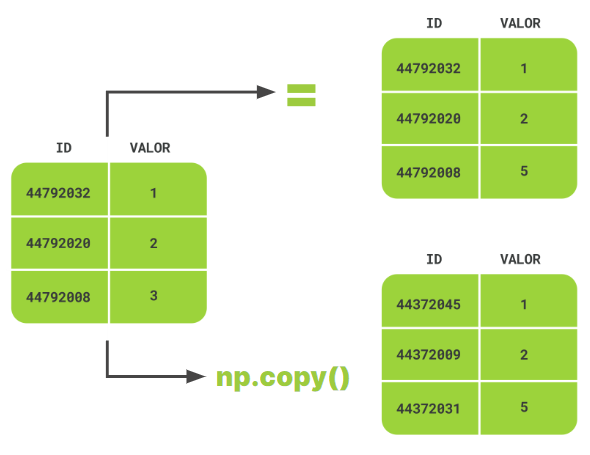

# Para saber más: copias de arrays

Cuando trabajamos con arrays u otras variables en Python, a menudo realizamos copias de las variables con las que estamos tratando. Cuando hacemos una copia de una variable, debemos tener en cuenta lo que sucede con ella para evitar utilizar ciertos valores pensando que son otros valores. Para manejar copias de arrays, la biblioteca Numpy tiene una función específica.

En este ejemplo, tengo un array con el nombre "precio_inmuebles" que quiero copiar.

precio_inmuebles = np.array([10000, 120000, 11000, 200000])

El objetivo es colocar los valores de este array en uno con un nombre específico para los precios de las propiedades en Lima. Vamos a hacer la copia utilizando el signo igual (=).

precio_inmuebles_lima = precio_inmuebles

Si verificas los valores en la nueva variable "precio_inmuebles_lima", verás que son los mismos que los de la variable "precio_inmuebles". Sin embargo, dado que "guardamos" los precios en la variable "precio_inmuebles_lima", ¿qué te parece reemplazar el valor de la primera propiedad en el array "precio_inmuebles" con uno nuevo que acaba de entrar en nuestro registro?

precio_inmuebles[0] = 120000

Si intentas reproducir el proceso realizado hasta ahora, verás que este cambio en el array "precio_inmuebles" también cambió la primera posición del array "precio_inmuebles_lima" al valor de 120000.

Para crear un array independiente del array original, existe una función en Numpy, "np.copy()". Para crear la copia utilizando esta función, simplemente sigue este código:

precio_inmuebles_lima = np.copy(precio_inmuebles)

De esta manera, incluso si modificamos el array "precio_inmuebles", no afectará al array "precio_inmuebles_lima".

Esto sucede porque, cuando usamos el signo igual para copiar el array, tenemos un nuevo array que apunta a las mismas ubicaciones en la memoria. En cambio, cuando usamos "np.copy()", las ubicaciones en la memoria son diferentes.

# Implementando una ecuación

Tatiana quería dibujar un círculo con la ayuda de la computadora. Para dibujar la parte superior del círculo, sabía que debía usar la ecuación:

y = sqrt(1 - x ^ 2)

Y para la parte inferior, solo tenía que usar la misma ecuación multiplicada por -1.

¿Cuál secuencia de código debe usar para construir el gráfico correctamente usando NumPy y sabiendo que ambas partes del círculo deben tener el mismo color?

respuesta [Implementado_una_ecuacion](Implementado_una_ecuacion.py)

# Para saber más: regresión

La regresión es ampliamente utilizada en ciencia de datos para la predicción y también para la interpolación de valores. Su uso tiene varios aspectos y hemos seleccionado algunos cursos de Alura Latam que puedes tomar para profundizar en el tema.

    Regresión Lineal: Análisis de correlaciones y previsión de resultados https://app.aluracursos.com/course/regresion-lineal-analisis-correlaciones-prevision-resultados

    Regresión Lineal: Técnicas Avanzadas de Modelado https://app.aluracursos.com/course/regresion-lineal-tecnicas-modelado

    Data Analysis: previsiones con Google Sheets https://app.aluracursos.com/course/data-analytics-previsiones-google-sheets

    Regresión: Implementa una red neuronal con numpy https://app.aluracursos.com/course/regresion-implementa-red-neuronal-numpy

# Lo que aprendimos en esta aula:

    Realizar operaciones entre arrays.
    Calcular la norma entre dos arrays.
    Implementar la regresión lineal.

