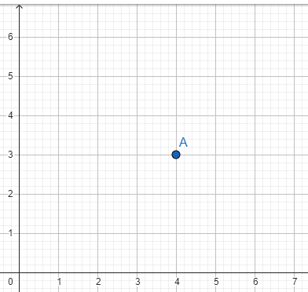
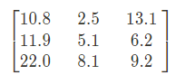
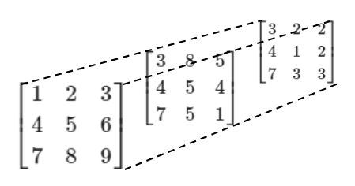

slide notation:
tomar fracciones del *array*

# seleccion de un intervalo

Charlie está trabajando con una base de datos de clientes de una tienda.

clientes = np.array([[1, 'Juan', 30, Calle A', 100, 'electrónicos'],
                     [2, 'Maria', 25, 'Calle B', 200, 'moda'],
                     [3, 'Pedro', 35, 'Calle C', 50, 'deportes']])

Las cuatro primeras columnas representan datos personales de los clientes y no puede usarlas en el análisis. Por lo tanto, pretende construir una nueva matriz llamada intencion_compras para almacenar solo las dos últimas columnas de los datos. ¿Qué comando debe utilizar para obtener el resultado deseado?

respuesta: [NumPy_analisis_numerico_eficiente_con_python\exploracion_de_datos\seleccion_de_un_intervalo.py](seleccion_de_un_intervalo.py)

# Para saber más: escalares, vectores y matrices

A lo largo de este curso, puedes notar cierta similitud entre los números y los arrays con escalares, vectores y matrices en matemáticas. Por lo tanto, hablaremos un poco sobre estos elementos.

Escalares

Los escalares son números simples utilizados en matemáticas o informática. Son números que usamos en una suma o multiplicación. Por ejemplo, la temperatura de hoy es de 27 °C, o mi peso es de 70 kg.

Vectores

En contraste, un vector es una estructura de datos que representa múltiples cantidades relacionadas. Por ejemplo, una secuencia de pesos de boxeadores en una categoría específica. En este caso, un ejemplo de un vector que representaría los pesos de cuatro boxeadores sería este: $(70.0, 72.0, 71.2, 70.5)$. Otro uso común para los vectores es representar la posición de las coordenadas de un objeto en el espacio. En el ejemplo de la figura a continuación, tenemos el punto A en las coordenadas (4,3). Los arrays de la biblioteca Numpy son adecuados para almacenar información de este tipo.

Figura de un punto en un plano bidimensional 

Matrices

Al igual que los vectores, las matrices son estructuras de datos que representan múltiples valores relacionados. Una tabla de datos se puede representar mediante una matriz. Aquí tienes un ejemplo de una matriz con 3 filas y 3 columnas:

Figura de una matriz con tres filas y tres columnas

Pero también podemos tener matrices 3D o con más dimensiones. En el ejemplo a continuación, puedes ver una matriz 3D.

Figura de una matriz con tres dimensiones, representada por tres matrices, dispuestas una detrás de la otra y vistas en un ángulo diagonal. Cada matriz es una matriz 3x3 que, juntas, forman la matriz de tres dimensiones.

Las matrices 3D tienen aplicaciones más avanzadas, como el procesamiento de imágenes, el trabajo con animaciones y la modelización matemática.

Un término que escucharás con frecuencia en este curso es "dimensiones". Este término se utilizará aquí para indicar en cuántos ejes varía una información. Por ejemplo, un vector es una secuencia de valores, por lo tanto, podemos decir que varía en solo una dimensión, es unidimensional. En cambio, una matriz 2D, una tabla de datos, tiene filas y columnas, por lo que decimos que es bidimensional.

El término dimensión también puede referirse al número de filas y columnas presentes en una matriz. Podemos tener una matriz con 5 filas y 3 columnas. Eventualmente, puedes ver el número de filas y columnas de una matriz mostrado en su esquina inferior derecha. Siempre escribimos primero el número de filas y luego el número de columnas. Estos números son importantes porque para operaciones como la suma y la multiplicación, las dimensiones de las matrices deben ser compatibles. Solo podemos sumar matrices con el mismo número de filas y columnas. Para que la multiplicación sea posible, el número de columnas de la primera matriz debe ser igual al número de filas de la segunda.

# Diferencia en un intervalo

Patty es una científica que está analizando una base de datos. Está utilizando la biblioteca NumPy para evaluar las columnas de una matriz de datos de un sensor de calor. Cada columna representa la misma información recopilada por un mismo sensor en momentos diferentes. Para validar si el sensor sigue calibrado, necesita que la diferencia entre los valores en las posiciones de una matriz llamada "base" y una columna de la matriz "medidas" sea menor que 0.01.

¿Cómo puede usar NumPy para realizar esta evaluación en la columna cero de la matriz?

    Alternativa correta

    np.allclose(base, medidas[:, 0], 0.01)

allclose() devolverá True si la diferencia entre los elementos de la matriz es menor que el valor proporcionado de 0.01.

# Determinando el número de NaNs

Estás trabajando con datos de ventas de tu puesto de jugo de limón. Cargaste los datos con load.txt() y, al visualizar la matriz, notaste que había algunos NaNs dentro de ella. Dado que se trata de un archivo grande, decidiste usar código para verificar el número total de estos valores. ¿Cuál es el código adecuado para obtener el resultado deseado en la matriz jugo_de_limon?

np.sum(np.isnan(jugo_de_limon))

También podemos usar np.sum(). Primero usamos isnan para generar una matriz de Verdaderos y Falsos y luego sumamos todos los valores de la matriz.
Alternativa correta

sum(np.isnan(jugo_de_limon))

Primero usamos isnan para generar una matriz de Verdaderos y Falsos y luego sumamos todos los valores de la matriz.

# Lo que aprendimos en esta aula:

    Realizar selecciones dentro de arrays.
    Construir gráficos utilizando Matplotlib.
    Comparar arrays.
    Verificar la existencia de NaNs.

