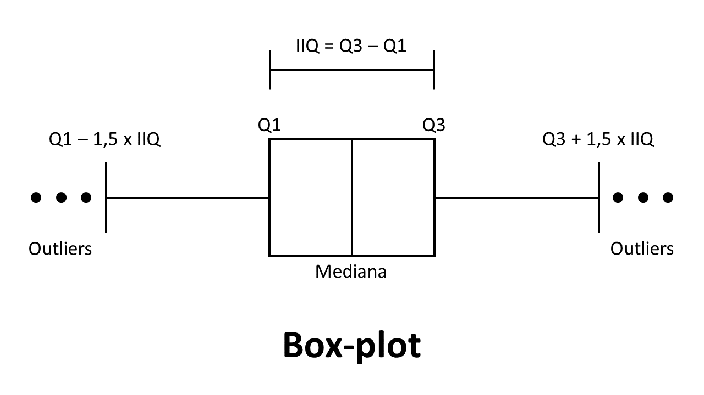
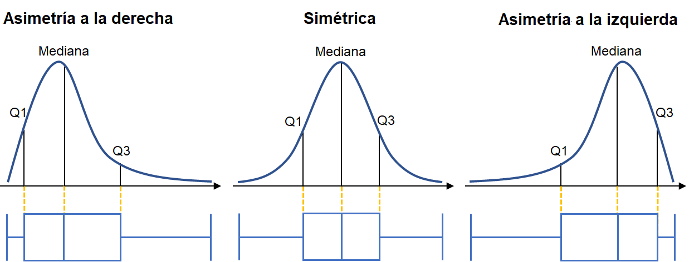

# Box-plot

Marque la alternativa que indica los estadísticos descriptivos necesarios para construir un box-plot:

1º cuartil, mediana y 3º cuartil.
¡Correcta! Como podemos ver con la siguiente figura:

# Asimetría de los datos

En nuestro curso vamos a trabajar con datos asimétricos, como vimos en el último video. Las siguientes alternativas muestran una representación gráfica de los comportamientos de las distribuciones de una variable que se pueden encontrar. ¿Qué imagen es la correcta?
Seleccione una alternativa

¡Correcta! Como podemos ver en nuestro notebook del curso.

#  Relación entre las variables dependiente y explicativas

Califique las siguientes afirmaciones y responda:

    La función pairplot(), del paquete seaborn, permite graficar solo los histogramas de las variables de un DataFrame;

    Los diagramas de dispersión permiten identificar la relación entre dos variables;

    Es posible trazar una recta de regresión entre dos variables usando la función pairplot() de seaborn.

    Alternativa incorreta

    Solo las declaraciones 2 y 3 son correctas.

¡Correcta! Usando diagramas de dispersión, podemos identificar si dos variables tienen una relación lineal entre ellas y también la dirección de esta relación.

# Haga lo que hicimos en aula: Análisis gráfico

Consolidando su conocimiento

Es hora de que sigas todos los pasos que he dado durante este video:

    Importar la biblioteca seaborn
    Configurar el formato de los gráficos
    Construir el box-plot de la variable dependiente
    Graficar la distribución de frecuencias de la variable dependiente
    Graficar los diagramas de dispersión entre las variables del dataset
    Analizar la dispersión entre las variables

Si ya lo ha hecho, excelente. Si no es así, es importante que ejecutes lo que se vio en los videos para poder continuar con el siguiente video.

# Lo que aprendimos en esta aula:

    Como configurar el formato de los gráficos.
    Como construir el box-plot de la variable dependiente.
    Como graficar la distribución de frecuencias de la variable dependiente.
    Como graficar los diagramas de dispersión entre las variables del dataset.
    Análisis de dispersión entre las variables.

