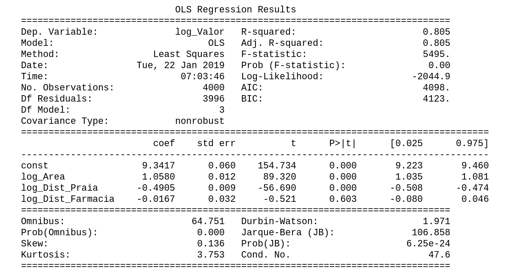

#  Procedimiento estándar en Data Science

La técnica de separar aleatoriamente un dataset en dos conjuntos distintos (conjuntos de entrenamiento y de prueba), estimar el modelo con datos de uno de estos conjuntos (conjunto de entrenamiento) y luego realizar predicciones con datos del segundo conjunto (conjunto de prueba), es una técnica ampliamente utilizada en data science para confirmar la efectividad de los modelos estimados.

Indique, en las opciones siguientes, qué funcionalidad de scikit-learn usamos para realizar dicha separación de datos.
Seleccione una alternativa

train_test_split()

¡Correcta! Para obtener más información sobre la función, acceda a la documentación de la biblioteca. https://scikit-learn.org/stable/modules/generated/sklearn.model_selection.train_test_split.html

# Estimando un modelo de regresión lineal con StatsModels

statsmodels es un módulo de Python que proporciona clases y funciones para estimar muchos modelos estadísticos diferentes, así como para realizar pruebas estadísticas y minería de datos.

Basado en nuestro último vídeo, indique la alternativa que muestra el código necesario para estimar un modelo de regresión lineal con la biblioteca statsmodels.

Nota: y_train y X_train son los datasets de entrenamiento para crear nuestro modelo.
Seleccione una alternativa

import statsmodels.api as sm
X_train_con_constante = sm.add_constant(X_train)
modelo_statsmodels = sm.OLS(y_train, X_train_con_constante, hasconst = True).fit()

Correcta! Como la de nuestro notebook de estudio.

# Pruebas formales de regresión lineal
La biblioteca statsmodels proporciona un conjunto más amplio de estadísticas de prueba sobre sus outputs. En nuestro curso, destacaremos las pruebas F y t.

Según lo que aprendimos en nuestro último video, juzgue los elementos a continuación y marque las alternativas correctas.
Selecciona 2 alternativas 

La prueba t se usa para probar la significancia de cada parámetro individualmente.

¡Correcta! Prueba la hipótesis de que el coeficiente es igual a cero.
Alternativa correta

La prueba F se utiliza para probar simultáneamente la importancia de un conjunto de parámetros.

¡Correcta! Prueba la hipótesis de que todos los coeficientes de regresión son iguales a cero.

# Interpretando las pruebas

Solo para ilustrar, considere el output del modelo estimado:

Aprendemos a identificar cuándo las pruebas t y F indican que todo es correcto, y luego podemos rechazar la hipótesis de que los parámetros no son significativos individual y conjuntamente. Indique la alternativa que presenta la forma correcta de llegar a esta conclusión.
Seleccione una alternativa

Prueba de significancia conjunta de los parámetros

Prob(F-statistic) <= 0.05 (OK)

Prueba de significancia individual de los parámetros

P>|t| <= 0.05 (OK)

¡Correcta! Como vimos en nuestro notebook del curso.

# Haga lo que hicimos en aula: Regresión Lineal con StatsModels

Consolidando su conocimiento

Es hora de que sigas todos los pasos que he dado durante este video:

    Importar la función train_test_split de la biblioteca scikit-learn
    Crear una Series, del Pandas, para almacenar los precios de los inmuebles
    Crear un DataFrame, del Pandas, para almacenar las variables explicativas
    Crear los datasets de entrenamiento y prueba
    Importar la biblioteca statsmodels
    Estimar el modelo de regresión lineal
    Analizar las estadísticas de prueba del modelo
    Modificar el modelo y ver el ajuste

Si ya lo ha hecho, excelente. Si no es así, es importante que ejecutes lo que se vio en los videos para poder continuar con el siguiente video.

# Lo que aprendimos en esta aula:

    Como preparar los datos y crear los datasets de entrenamiento y prueba.
    Como estimar el modelo de regresión lineal.
    Como analizar las estadísticas de prueba del modelo.
    Como modificar el modelo y ver el ajuste.

