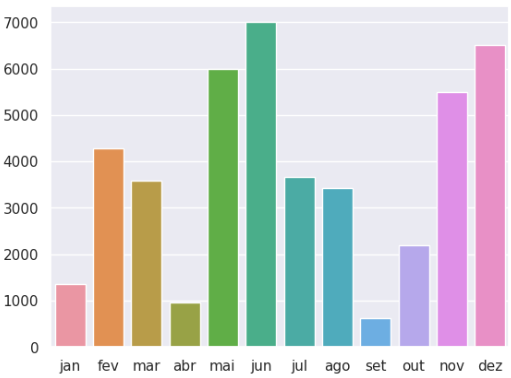

# Graficando datos de una e-comerce con Seaborn

Bruna, una profesional que trabaja en una empresa de comercio electrónico, tiene la responsabilidad de analizar las ventas de productos del último año. Para ello, recopiló los datos de ventas de cada mes y los almacenó en un DataFrame llamado df. Este DataFrame, que contiene la información sobre las ventas de productos, tiene una columna con los meses y una columna llamada ventas, que representa el número total de ventas realizadas en cada mes. El código para generarlo fue el siguiente:
```python
import pandas as pd

meses = ['ene', 'feb', 'mar', 'abr', 'may', 'jun', 'jul', 'ago', 'sep', 'oct', 'nov', 'dic']
ventas = [1200, 4100, 3800, 1000, 6000, 7000, 3800, 3700, 700, 2000, 5600, 8000]

df = pd.DataFrame({'mes': meses, 'ventas': ventas})
```
Para visualizar esta información de manera más clara, Bruna utilizó la biblioteca Seaborn para crear un gráfico de barras y obtuvo el siguiente resultado:



Marque todas las opciones que contengan información correcta sobre gráficos con la biblioteca Seaborn:

Para dejar el gráfico con el tema predeterminado de la biblioteca Seaborn, Bruna utilizó la función set_style() sin pasar ningún argumento.

La función set_style() de la biblioteca Seaborn permite definir el estilo del gráfico. Cuando no se pasa ningún argumento a la función, utiliza el estilo predeterminado "darkgrid" de la biblioteca Seaborn.

Bruna utilizó el código sns.barplot(x='mes', y='ventas', data=df) para trazar este gráfico de barras.

Este código es una forma correcta de utilizar la función barplot() de la biblioteca Seaborn para trazar un gráfico de barras. El argumento x define el eje X del gráfico, que en este caso es la columna mes, y el argumento y define el eje Y del gráfico, que en este caso debe ser la columna ventas. El argumento data debe recibir el DataFrame que contiene los datos.

# Para saber más: los colores permiten que tus datos sean más fáciles de entender


Las colores pueden ser un elemento poderoso para hacer tus datos más comprensibles y efectivos en la comunicación de insights. La elección de los colores puede ser un factor crucial para el éxito de un gráfico, ya que pueden ayudar a destacar información importante y atraer la atención del público.

La biblioteca Seaborn ofrece diversas paletas de colores, que son combinaciones predefinidas de colores que pueden usarse en tus gráficos. Estas paletas están diseñadas para ser visualmente atractivas y para asegurar que los colores utilizados sean fácilmente distinguibles entre sí, en el caso de las paletas categóricas. Sin embargo, elegir la paleta más adecuada puede ser un desafío, ya que depende del contexto y del objetivo de la visualización. Por lo tanto, podemos considerar que es posible crear gráficos más interesantes y atractivos al elegir los colores correctos.

Al elegir una paleta de colores para tu gráfico, es interesante considerar incluso las emociones que deseas transmitir al espectador. Los colores pueden despertar, por ejemplo, sentimientos de tranquilidad, entusiasmo, seriedad y mucho más. Por lo tanto, selecciona cuidadosamente los colores que ayudarán a transmitir el mensaje deseado y a crear la atmósfera adecuada para tu gráfico.

Para ayudarte en este proceso, sigue algunos consejos al elegir los colores:

    Considera el tipo de dato que se está ploteando: datos categóricos, datos secuenciales o datos divergentes requieren diferentes tipos de paletas de colores, como discutimos en el video anterior.
    Elige colores que sean fácilmente distinguibles unos de otros, si estás usando múltiples series de datos en un solo gráfico.
    Evita colores muy brillantes y saturados, ya que pueden ser demasiado intensos y distraer la atención del público.
    Usa colores de manera consistente en todos tus gráficos para facilitar la comparación entre ellos.
    Considera el contexto en el que el gráfico será utilizado y si los colores elegidos son apropiados para ese contexto.

Como mencionamos anteriormente, una capacidad importante de los colores es despertar diferentes reacciones en las personas que los observan. Para ilustrarlo, nota el ambiente a tu alrededor: colores como el verde generalmente se asocian con sentimientos positivos, como alegría, esperanza, crecimiento y salud. Por lo tanto, estos colores generalmente se usan para destacar información positiva o indicar que algo está yendo bien. Por otro lado, colores más oscuros como el rojo y el negro, pueden tener connotaciones negativas y usarse para llamar la atención sobre información crítica o problemática.

Una Mirada a la Accesibilidad

Algo que debemos considerar al crear visualizaciones de datos es la experiencia de los usuarios. ¿A qué nos referimos con esto? Debemos prestar atención a los colores y al tamaño de las fuentes que usamos, para que tengamos una visualización fácil y accesible para nuestro público.

Un punto recurrente de adaptación que debemos considerar en nuestros gráficos es aquel que beneficiará a las personas con daltonismo, que tienen dificultades para distinguir ciertos colores. Incluso, existen herramientas en línea que podemos utilizar para probar si nuestros gráficos serán bien comprendidos por personas con daltonismo.

Un buen sitio para verificar los colores de nuestras imágenes es Coblis - Color Blindness Simulator. https://www.color-blindness.com/coblis-color-blindness-simulator/
 En esta página puedes subir tus imágenes y visualizar cómo se ven los colores en diferentes tipos de daltonismo.

Atención: Este es un tema extenso que siempre merece atención al realizar nuestras visualizaciones de datos para un público diverso. Por lo tanto, es recomendable elegir colores que tengan suficiente contraste y que sean fácilmente distinguibles entre sí.

Finalmente, es importante recordar que la elección de colores no debe reemplazar la calidad de los datos y del análisis. Los colores deben usarse para complementar la información presentada en el gráfico, no para distraer o confundir a nuestro público objetivo. Por lo tanto, vale la pena invertir tiempo en el análisis de datos y en la elección de colores para asegurar que el gráfico sea efectivo y fácil de entender. De esta manera, puedes garantizar una experiencia positiva y efectiva en la comunicación de tus datos a través de las visualizaciones.

# Desafío: creando un gráfico de líneas con Seaborn


¡Felicidades por llegar hasta aquí! Volviendo a los datos utilizados en el proyecto que estamos desarrollando en este curso, ahora es el momento de utilizar todos los conocimientos adquiridos sobre las bibliotecas Matplotlib y Seaborn.

En esta etapa, tu desafío es crear una figura que muestre las tendencias de inmigración de los 4 mayores países de América Latina: Brasil, Argentina, Perú y Colombia. A través de esta creación, puedes explorar diversas posibilidades y mostrar de manera atractiva tu proceso de desarrollo. Y no nos olvidemos de las indicaciones. Esta figura debe tener una línea para cada país, título, etiquetas en los ejes, colores apropiados, un tema de la biblioteca Seaborn y una leyenda. Por lo tanto, piensa en cuestiones de accesibilidad, como el tamaño de las fuentes y el grosor de las líneas. Es importante elegir colores adecuados que no causen fatiga visual o dificulten la lectura de la información. Además, el tamaño de las fuentes debe ser lo suficientemente legible para que las personas puedan interpretar los datos fácilmente.

Consejo: para elegir la paleta de colores, también puedes consultar la documentación de la biblioteca Matplotlib. Seaborn utiliza los colormaps de Matplotlib por defecto, además de ofrecer sus propias paletas de colores. Para aplicar una paleta de colores a todas las líneas de la figura, puedes usar la función sns.set_palette() y pasarle el nombre de la paleta elegida.

Estamos emocionados por ver el resultado de tu trabajo y las historias que contarás a través de este gráfico. ¡Manos a la obra y diviértete!


# Lo que aprendimos en esta clase:

    Importar la biblioteca Seaborn;
    Definir el tema predeterminado de la biblioteca Seaborn;
    Crear un gráfico de barras vertical y horizontal;
    Agregar título y etiquetas a los ejes;
    Utilizar las bibliotecas Seaborn y Matplotlib juntas;
    Cambiar los colores utilizando paletas;
    Explorar diferentes temas;
    Eliminar los bordes de un gráfico con la función sns.despine().

