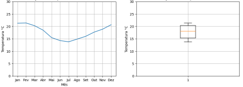

#  Facilitando la interpretación de datos

 En un mundo impulsado por la búsqueda constante de ideas y resultados, Tomás es un científico de datos que está trabajando en un proyecto que implica el análisis y la predicción de ventas de un comercio electrónico. Inmerso en este desafiante proyecto, concentra sus esfuerzos en alcanzar sus objetivos.

En este momento, los datos que posee están almacenados en un DataFrame llamado df, que fue obtenido con el siguiente código:
```python
import pandas as pd

datos_ventas = {
    'mes': [1, 2, 3, 4, 5, 6, 7, 8, 9, 10, 11, 12],
    'ventas': [10000, 11000, 12000, 13000, 14000, 15000, 16000, 17000, 18000, 19000, 20000, 21000]
}

df = pd.DataFrame(datos_ventas)
```
Con sus grandes habilidades, Tomás necesita crear un gráfico que muestre la evolución de las ventas a lo largo del tiempo y agregar un título y etiquetas a los ejes X e Y para facilitar la interpretación de los datos. Para esto, decide utilizar la biblioteca Matplotlib.

¿Cuál es el código correcto para crear la figura, agregar un título y las etiquetas de los ejes que le indicarías?
```python
fig, ax = plt.subplots(figsize=(10, 4))
ax.plot(df['mes'], df['ventas'])
ax.set_title('Evolución de las ventas diarias')
ax.set_ylabel('Número de ventas')
ax.set_xlabel('Mes')
plt.show()
```
El código es correcto, ya que crea un objeto de figura fig y un objeto de ejes ax utilizando la función plt.subplots(). Luego, el objeto ax se utiliza para trazar el gráfico de línea con la función plt.plot(). Las etiquetas de los ejes y el título se agregan utilizando las funciones set_xlabel(), set_ylabel() y set_title(). Finalmente, el gráfico se muestra utilizando la función show().

# Analizando datos climáticos

Conoce a Ana, una científica de datos que se ocupa del análisis climático en una empresa de renombre. Ella creó un gráfico con dos subgráficos para mostrar la variación de la temperatura media mensual y la distribución de los datos de temperatura para una ciudad específica. El subgráfico de la izquierda muestra la evolución de la temperatura a lo largo del año mediante un gráfico de líneas. Mientras que el subgráfico de la derecha muestra un diagrama de caja con la distribución de las temperaturas mensuales, permitiendo así una visualización detallada de la variación de la temperatura para el período en análisis.

4.png

Basándote en esta figura, elige la alternativa correcta:

Ana utilizó la función plt.subplots() para crear los subgráficos y pasó a esta función los valores 1,2 para crear una fila y dos columnas de subgráficos.

La función plt.subplots() devuelve una figura y una matriz de ejes (axes), que se puede usar para crear múltiples subgráficos en una figura. Al pasar los valores 1 y 2 como argumentos, Ana creó una figura con una fila y dos columnas de subgráficos, que es exactamente el diseño descrito en la alternativa.

# Para saber más: buenas prácticas de visualización de datos para subplots


Juliana, una talentosa científica de datos, decidió sumergirse en un intrigante proyecto en el universo del retail. Con su conocimiento, y a través de su análisis de datos, ha investigado las ventas mensuales de diferentes productos en varias tiendas de la empresa. Con el objetivo de entender mejor esos datos, decidió crear un conjunto de subplots para comparar las ventas de diferentes productos en cada tienda.

Sin embargo, en el transcurso de la creación de esos subplots, Juliana pudo notar la importancia de seguir algunas buenas prácticas de visualización de datos para crear subplots efectivos y así garantizar que la figura resultante fuera clara y fácil de entender. Aquí están algunas sugerencias que ayudaron a Juliana a hacer su figura más detallada e informativa:

    Usar títulos claros y concisos: el título de cada subplot debe ser corto y descriptivo para que el lector pueda rápidamente entender lo que se está mostrando en cada elemento. Además, si estás comparando diferentes conjuntos de datos, puede ser útil añadir un subtítulo explicando lo que se está comparando.

    Mantener la misma escala en los ejes: para evitar distorsiones en la comparación entre los subplots, es importante mantener la misma escala en los ejes X e Y en todos ellos. Esto se puede hacer utilizando las funciones set_xlim() y set_ylim().

    Evitar la superposición de gráficos: es importante asegurarse de que cada subplot esté claramente separado de los demás, sin superposición. Si hay una superposición, la figura puede volverse confusa y difícil de entender. Una manera de evitar superposiciones es ajustar el tamaño de los subplots para que haya espacio suficiente entre ellos. Además, podemos añadir la función fig.subplots_adjust() que recibe el parámetro hspace. Controla el espaciado vertical entre los subplots y el parámetro wspace, que controla el espaciado horizontal. El valor por defecto de estos parámetros es 0.2, pero puedes ajustarlos según tus necesidades.

Recuerda que el valor pasado a estos parámetros es un número decimal que representa la fracción del tamaño de la figura, por ejemplo, 0.5 significa que el espaciado será del 50% de la altura/anchura de la figura.

Con estas buenas prácticas en mente, Juliana creó sus subplots y logró visualizar las ventas diarias de diferentes productos de forma clara y efectiva en varias tiendas de la empresa. Fue capaz de identificar patrones interesantes en los datos y usó esa información para hacer recomendaciones útiles para la empresa, dejándonos insights valiosos sobre buenas prácticas de visualización de datos para subplots.

¿Qué tal impulsar la calidad y el impacto de tus visualizaciones poniendo en práctica estas valiosas sugerencias? Explora y experimenta todas estas posibilidades. Esta iniciativa, sin duda alguna, marcará una diferencia en tu desarrollo.

# Lo que aprendimos en esta clase:

    Agregar título y etiquetas a los ejes en una figura;
    Crear una figura que contenga subplots en una dirección;
    Crear una figura que contenga subplots en dos direcciones;
    Modificar el espaciado entre subplots;
    Entender cómo diferentes escalas en el eje Y pueden causar distorsiones en la interpretación de los resultados;
    Aplicar la misma escala en el eje Y en una figura que contenga subplots;
    Crear un título general en una figura que contenga subplots.

