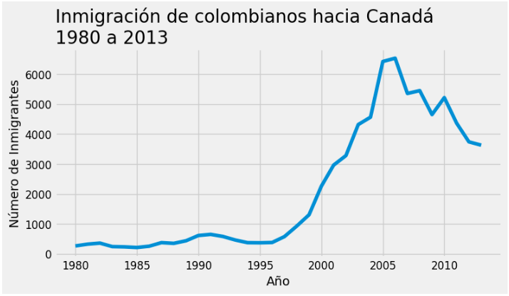
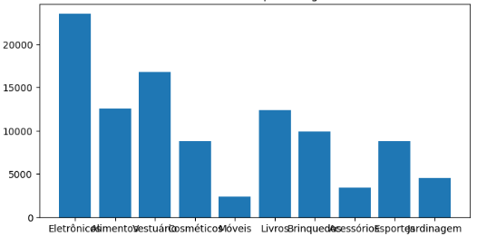

# Para saber más: alterando los estilos

Personalizamos las visualizaciones en el video anterior, cambiando el tamaño de las fuentes, modificando la posición del título y también añadiendo elementos como marcadores y rejillas a las figuras. Pero además, según la documentación https://matplotlib.org/stable/gallery/style_sheets/index.html de la biblioteca Matplotlib, podemos aplicar diferentes estilos para permitirnos adaptar las visualizaciones de acuerdo con nuestras necesidades. Para saber qué estilos están disponibles, podemos imprimir plt.style.available, donde style es un submódulo de la biblioteca Matplotlib utilizado para definir estilos de visualización:
```python
print(plt.style.available)
```
El resultado es una lista que contiene todos los estilos disponibles:
```python
['Solarize_Light2', '_classic_test_patch', '_mpl-gallery', '_mpl-gallery-nogrid', 'bmh', 'classic', 'dark_background', 'fast', 'fivethirtyeight', 'ggplot', 'grayscale', 'seaborn-v0_8', 'seaborn-v0_8-bright', 'seaborn-v0_8-colorblind', 'seaborn-v0_8-dark', 'seaborn-v0_8-dark-palette', 'seaborn-v0_8-darkgrid', 'seaborn-v0_8-deep', 'seaborn-v0_8-muted', 'seaborn-v0_8-notebook', 'seaborn-v0_8-paper', 'seaborn-v0_8-pastel', 'seaborn-v0_8-poster', 'seaborn-v0_8-talk', 'seaborn-v0_8-ticks', 'seaborn-v0_8-white', 'seaborn-v0_8-whitegrid', 'tableau-colorblind10']
```
¡Podemos explorar uno de estos estilos para mejorar aún más nuestras visualizaciones!

Antes de aplicar un estilo, es importante saber que cada vez que la biblioteca Matplotlib es importada en un notebook, define una configuración de tiempo de ejecución que incluye los estilos predeterminados para cada elemento de trazado creado.

Por lo tanto, para evitar que el estilo se aplique a todos los gráficos trazados en el mismo notebook, podemos utilizar un código que crea una copia de las configuraciones predeterminadas de trazado de la biblioteca Matplotlib y las asigna a la variable IPython_default. Esto puede ser útil para almacenar y reutilizar las configuraciones predeterminadas de trazado o para restaurarlas después de haber sido modificadas:
```python
IPython_default = plt.rcParams.copy()
```
Uno de los estilos disponibles se basa en un sitio de noticias y análisis de datos llamado FiveThirtyEight, que cubre temas como política, economía, cultura, ciencia y deportes.

Para utilizar el estilo 'fivethirtyeight', usamos el siguiente código:
```python
plt.style.use('fivethirtyeight')
```
A continuación, podemos crear la figura, que tendrá este nuevo estilo incorporado:
```python
fig, ax = plt.subplots(figsize=(8, 4))
ax.plot(datos_col['Año'], datos_col['Inmigrantes'])
ax.set_title('Inmigración de colombianos hacia Canadá\n1980 a 2013', fontsize=20, loc='left')
ax.set_ylabel('Número de Inmigrantes', fontsize=14)
ax.set_xlabel('Año', fontsize=14)
ax.yaxis.set_tick_params(labelsize=12)
ax.xaxis.set_tick_params(labelsize=12)
ax.xaxis.set_major_locator(plt.MultipleLocator(5))
plt.show()
```
El resultado será el gráfico mostrado abajo:

3.png

Los gráficos creados con el estilo FiveThirtyEight son atractivos y poseen una estética limpia y minimalista, con líneas más gruesas y colores vibrantes.

Bueno, ¿y si queremos trazar gráficos sin este estilo después de haberlo definido en el notebook? Podemos redefinir los parámetros utilizando plt.rcParams.update y pasándole la variable IPython_default que creamos anteriormente con las configuraciones predeterminadas:
```python
plt.rcParams.update(IPython_default);
```
Además, podemos aplicar un estilo solo a un bloque de código específico, ya que el paquete de estilo proporciona un administrador de contexto para limitar sus cambios a un ámbito específico. Para aislar tus cambios de estilo, puedes escribir el código dentro de un contexto with de la siguiente manera:
```python
with plt.style.context('fivethirtyeight'):
  fig, ax = plt.subplots(figsize=(8, 4))
  ax.plot(datos_col['Año'], datos_col['Inmigrantes'])
  ax.set_title('Inmigración de colombianos hacia Canadá\n1980 a 2013', fontsize=20, loc='left')
  ax.set_ylabel('Número de Inmigrantes', fontsize=14)
  ax.set_xlabel('Año', fontsize=14)
  ax.yaxis.set_tick_params(labelsize=12)
  ax.xaxis.set_tick_params(labelsize=12)
  ax.xaxis.set_major_locator(plt.MultipleLocator(5))
  plt.show()
```
¿Te gustó este nuevo estilo? La biblioteca Matplotlib ofrece una variedad de estilos, además de FiveThirtyEight, que podemos probar y aplicar a nuestros datos. Con estas opciones, podemos hacer nuestras visualizaciones aún más atractivas, mejorando la presentación de la información que queremos transmitir.

# Mejorando una visualización

Gustavo trabaja en el área de Datos en una empresa que vende diversos productos y necesita crear un gráfico para presentar el desempeño de ventas de diversas categorías de productos durante el último año. Para generar una figura con el número de ventas se ejecutó el siguiente código:
```python
fig, ax = plt.subplots(figsize=(8, 4))
ax.bar(df['Categoría'], df['Ventas'])
ax.set_title('Total de ventas por categoría')
ax.set_xlabel('Categoría')
ax.set_ylabel('Total de ventas')
plt.show()
```
Sin embargo, la figura generada quedó de la siguiente manera:

5.png

¿Cómo puede Gustavo mejorar esta visualización? Marque todas las alternativas que contengan información correcta y que él pueda realizar:

## Las barras pueden ser colocadas en horizontal, para facilitar la visualización de las categorías.

Cuando tenemos muchas categorías, puede ser más interesante utilizar un gráfico de barras horizontal en lugar de uno vertical. Esto se debe a que, en un gráfico de barras vertical, las barras pueden volverse muy estrechas y, por lo tanto, difíciles de leer, especialmente si las categorías tienen nombres largos. En cambio, en un gráfico de barras horizontal, las barras son más anchas y el eje Y se utiliza para mostrar las categorías, lo que facilita la visualización y la lectura de la información.
Alternativa correta

## Dejar cada barra con un color diferente.

Dejar las barras de un gráfico con colores diferentes puede ser una forma efectiva de resaltar las diferencias entre las categorías representadas. El color es una de las propiedades visuales más poderosas para la percepción humana y puede ayudar a enfatizar la información más importante, además de hacer que el gráfico sea más atractivo visualmente.
Alternativa correta

## Ordenar las categorías de mayor a menor valor.

Ordenar las barras de un gráfico de mayor a menor valor puede ser una forma efectiva de facilitar la comparación entre las categorías representadas. Esta aproximación hace más fácil identificar qué categorías tienen los valores más altos y cuáles tienen los valores más bajos. De esta manera, es posible destacar claramente las categorías con los mayores valores, llamando la atención del público sobre esta información. Esto puede ser especialmente útil cuando se tienen muchas categorías, ya que puede ayudar a evitar que la información se vuelva confusa y difícil de interpretar.

# Desafío: personalizando los subplots con los datos de ventas de tiendas diferentes

¡Otra etapa de desafío está comenzando! Aprovecha la oportunidad propuesta y sumérgete en las posibilidades. En la clase anterior, tuviste el desafío de crear una figura con subgráficos que presentan la variación en el número de ventas en cuatro tiendas diferentes a lo largo de un año. ¡Ahora es el momento de llevar esa figura a un nuevo nivel! ¡Es hora de personalizarla! En esta segunda parte del desafío, debes explorar las opciones de personalización de los subgráficos para hacer que la figura sea más clara y atractiva para la gerencia de la empresa.

Algunas ideas de personalización que puedes explorar son:

    Cambiar la posición de los títulos de los subgráficos a la izquierda.
    Aumentar el tamaño de la fuente del título general de la figura para resaltarlo.
    Aumentar el tamaño de los títulos y etiquetas de los ejes de los subgráficos.
    Hacer que las líneas sean más gruesas.
    Cambiar el color de las líneas de cada tienda para diferenciarlas aún más.

¡Siéntete libre de probar más personalizaciones!

Y aquí va otro consejo: puedes reducir el tamaño del código utilizando el comando for i, ax in enumerate(axs.flat):, que permite un bucle que itera sobre todos los subgráficos de la figura. Dentro de este bucle, puedes pasar las funciones plot, set_title, set_xlabel, set_ylabel, y así sucesivamente...

Recuerda que los datos son los siguientes:
```python
tiendas = ['A', 'B', 'C', 'D']
ventas_2022 = {'Ene': [100, 80, 150, 50],
    'Feb': [120, 90, 170, 60],
    'Mar': [150, 100, 200, 80],
    'Abr': [180, 110, 230, 90],
    'May': [220, 190, 350, 200],
    'Jun': [230, 150, 280, 120],
    'Jul': [250, 170, 300, 140],
    'Ago': [260, 180, 310, 150],
    'Sep': [240, 160, 290, 130],
    'Oct': [220, 140, 270, 110],
    'Nov': [400, 220, 350, 190],
    'Dec': [300, 350, 400, 250]}
```
¡Ahora es el momento de poner manos a la obra! Experimenta diferentes personalizaciones y haz que la figura sea aún más impresionante. ¡Vamos!


### Lo que aprendimos en esta clase:

    Modificar el tamaño de las fuentes del título y las etiquetas de los ejes;
    Modificar la posición del título;
    Cambiar el grosor de la línea;
    Agregar marcadores a la línea del gráfico;
    Agregar cuadrículas al fondo del gráfico;
    Cambiar el color de solo una variable;
    Cambiar los colores cuando tenemos varias categorías;
    Crear un gráfico de barras horizontal;
    Resaltar información en un gráfico;
    Agregar anotaciones de texto;
    Eliminar el marco alrededor del gráfico y hacerlo más limpio;
    Guardar las figuras.

